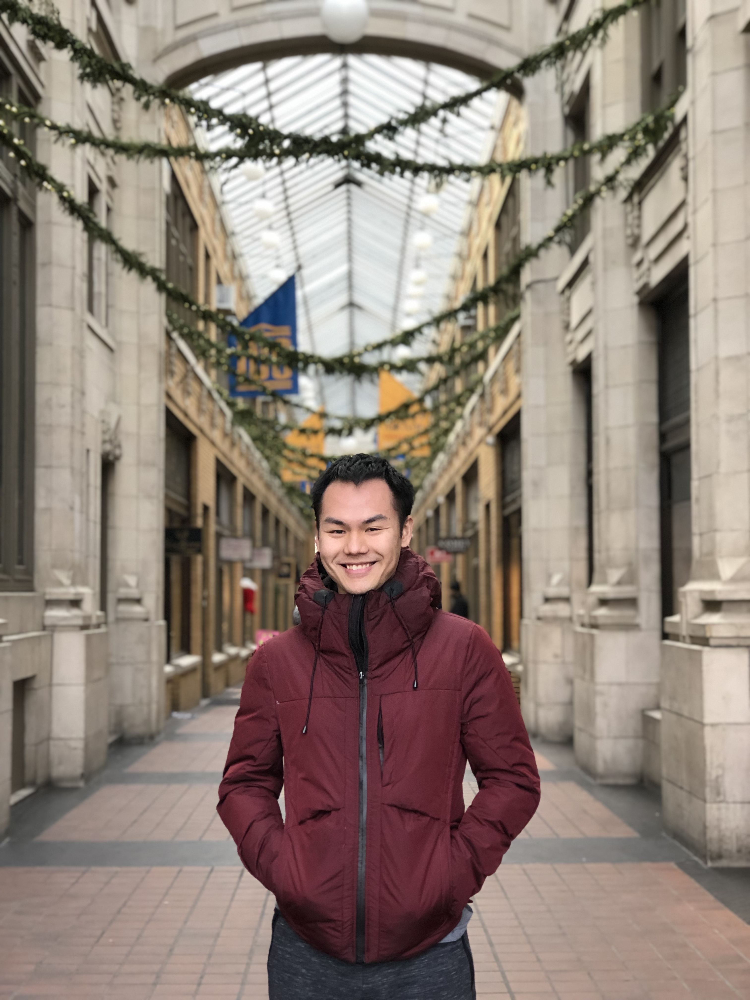

Johnson Zhong

[Resume](res/resume.pdf)

My name is Johnson (Sheng) Zhong and you've stumbled upon my [site](/portfolio/projects/portfolio/)!  
As a first year engineering science student, my class is developing a broad and deep foundation in the sciences.  
Simultaneously, we are learning how to apply that knowledge base to real life situations, as seen in the [evaluations](/portfolio/evaluations/).  
Our curriculum challenges us to move from first principles to implementation - taking an idea and converting it to technology.  
However, I am personally defined more by what I do above and beyond this curriculum.  

I believe having control over many tools and being able to switch perspectives are what makes a robust problem solver.  
To that effect, I turn every school assignment and projects I do outside of class into an opportunity to develop new skills and hone old ones.  
I started programming with C++ the summer of 2013, moving onto python in September.  
These languages became tools I used outside of class for **analysis and optimization** ([truss bridge design](/portfolio/projects/bridgedesign/#design)),  
**creative problem solving** ([IEEEXtreme programming competition](ieee.html)), and **communication** ([3D modelling](projects/binder/#prototype)).  

Beyond being robust, I also strive to be innovative.  
I believe innovation comes from making connections across disciplines and noticing minute details.  
This explains my choice in the engineering science program, which covers all areas of science,  
and my principle of designing for usability through attention to detail, which encourages innovation.  
Being innovative also comes from questioning assumptions and exploring boundaries.  
Here's a [sample](evaluations/skulecourses/) of some of my sillyness :).  

 
 
 
 
 
 
 
 
 
 
 
 
 
 