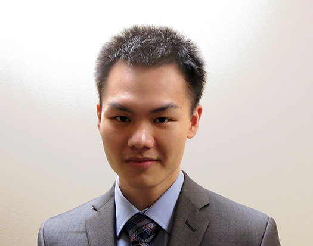

Johnson Zhong

My name is Johnson (Sheng for legal) Zhong and you've stumbled upon my [site](/portfolio/projects/portfolio/)!  
As a first year engineering science student, my class is developing a broad and deep foundation in the sciences.  
Simultaneously, we are learning how to apply that knowledge base to real life situations, as seen in the [evaluations](/portfolio/evaluations/).  
However, I am personally more defined by what I do above and beyond the curriculum.  

My approach to education is to take every opportunity to learn and master new tools, which teaches me to learn quickly.  
I believe being able to learn quickly and having control over many tools is what makes a robust problem solver.  
I started programming with C++ the summer of 2013, and with python since September, but it quickly became a tool I used to  
solve problems in other courses, such as efficiently iterating through the [truss bridge design](/portfolio/projects/bridgedesign/#design).  
Web development was a tool that I learned as I made made this site, and you can track my progress via the page history on every footer.  

Beyond being robust, I also strive to be innovative.  
I believe innovation comes from making connections across disciplines and noticing minute details.  
This explains my choice in the engineering science program, which covers all areas of science,  
and my principle of designing for usability through attention to detail, which encourages innovation.  
Being innovative also comes from questioning assumptions and exploring boundaries.  
Here's a [sample](evaluations/skulecourses/) of some of my sillyness :).  
 
 
 
 
 
 
 
 
 
 
 
 
 
 