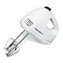
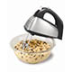
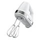

	The Proctor Silex 43-21012 model hand mixer was the second artifact me and my room mate evaluated in Praxis,  
	and the one that I wrote a device design report for (expect more research than the last one).  
	This product was mostly designed for efficiency, safety, and usability.

<h2 class="anchor">Design for Efficiency <a class="anchor-link" title="permalink to section" href="#efficiency" name="efficiency">¶</a></h2>
-----------------------
The 43-21012 runs at 125W, 120V, and 60Hz on both AC and DC power, a consequence of its universal motor.  
It is much cheaper, lighter, and smaller than its competitors.
<table class="pretty">
<tr>
	<th></th>
	<th>
Hand mixer model
</th>
	<th>
Power (W)
</th>
	<th>
Price ($)
</th>
	<th>
Amazon shipping weight (lb)
</th>
	<th>
Amazon dimensions (in)
</th>
	<th>
Volume (cubic in)
</th>
</tr>
<tr>
	<td></td>
	<td>
Proctor Silex 43-21012
</td>
	<td>
125
</td>
	<td>
8.99
</td>
	<td>
1.7
</td>
	<td>
6.4 x 3.4 x 7.4
</td>
	<td>
161
</td>
</tr>
<tr>
	<td></td>
	<td>
Hamilton Beach 62650
</td>
	<td>
290
</td>
	<td>
25.99
</td>
	<td>
5
</td>
	<td>
10.5 x 8.5 x 7.5
</td>
	<td>
669
</td>
</tr>
<tr>
	<td></td>
	<td>
Cuisinart HM-70
</td>
	<td>
220
</td>
	<td>
58.99
</td>
	<td>
4
</td>
	<td>
9 x 4.2 x 6
</td>
	<td>
227
</td>
</tr>
<tr>
	<td></td>
	<td>
KitchenAid KHM720ER (DC)
</td>
	<td>
60
</td>
	<td>
69.99
</td>
	<td>
9
</td>
	<td>
5.5 x 9.2 x 7.8
</td>
	<td>
395
</td>
</tr>
<tr>
	<td></td>
	<td>
Kitchen Aid KHM5DH Ultra Power
</td>
	<td>
Unknown
</td>
	<td>
51.99
</td>
	<td>
3.3
</td>
	<td>
3.5 x 7.5 x 6.4
</td>
	<td>
168
</td>
</tr>
</table>

	It accomplishes this through compact packaging, both internally and externally.  
	Additionally, the electronics inside are fully analog,  
	eliminating the need for circuit boards as in some competitors.

Very compact packaging

Compact internals to reduce size; all analog wiring

	Its small size is due to the use of a universal motor, which requires only a small step-down transformer.  
	Compared to similar products, some use AC systems that also require a transformer but are restricted  
	in rotational speed by the power line frequency.  
	DC systems require both a transformer and an AC-DC converter, increasing size and power loss.  

	The drawback of the universal motor is that it uses a commutator, which wear out with use and produces  
	a lot of noise. However, hand mixers are intermittently used, thus the product is relatively unaffected  
	by its loss of durability.  In sacrificing long term use for usability in decreased size and weight is  
	efficient design in the context of a hand mixer that isn't employed continuously.

Tiny transformer under the motor

	The setup of the gears and fan was efficiently designed - the motor  
	shaft turns the cooling fan and the gears of the beaters simultaneously.  
	Since the gears are placed on either side of the shaft, they turn oppositely at the same speed,  
	producing zero net torque so that the user's bowl does not start spinning.  
	The cooling fan provides a load in the absence of an external one to limit the motor  
	from operating above a safe temperature. All of these features are accomplished simply by the setup.

Ingenious setup to provide usability and safety

<h2 class="anchor">Design for Safety <a class="anchor-link" title="permalink to section" href="#safety" name="safety">¶</a></h2>
---------------------

	Apart from the setup mentioned above, additional safety features were also part of the design.  
	As the picture above shows, the gears are made of plastic - this allows the gears to  
	yield first, jamming the motion to protect the motor from burning out, a safe failing mode.

	The picture illustrating compact internals also shows that the wiring is enclosed by plastic  
	and tied down.

	Another safety feature is the use of plug seals that prevent food from entering and which makes  
	an audible click when properly inserted to provide user feedback on insertion status.  

Beater plug seal; makes audible click when inserted

<h2 class="anchor">Design for Usability <a class="anchor-link" title="permalink to section" href="#usability" name="usability">¶</a></h2>
-----------------------

	The hand beater was designed with the kitchen in mind, as it has no sharp edges that could  
	harm children and the counter. Its flat bottom also allows it to sit upright when not in use,  
	which saves space in a place where space might be limited.  

	Apart from its light weight and small size, its omnibutton (one button for all functions) also  
	provides intuitive and easy use.  

Omnibutton that provides full functionality!

	Sliding the handle puts the beater in different modes, which is simply done by going through  
	different wiring. Pushing down the button ejects the beaters, which can only be done in off  
	mode for safety reasons, as implemented by the asymmetrical shape of the button.

<h2 class="anchor">Potential Improvements <a class="anchor-link" title="permalink to section" href="#improvements" name="improvements">¶</a></h2>
----------------

	One great detriment to usability and **perceived safety** is the loud noise it produces during use.  
	Loud noise gives the impression that the product is unstable and may scare away children.  
	The noise is in part due to the small size of the fan and the use of a universal motor.  
	The motor likely cannot be altered without sacrificing size, cost, or weight.  

	The fan, however, could be made larger. Because of its small size, it turns at greater frequency  
	to push the same volume of air. A larger fan would produce less noise while providing the same cooling.  
	Additionally, the motor would run at a lower frequency, decreasing noise production in that aspect  
	and a longer life cycle due to less wear on the commutator.  
	The actual damage on performance would be minimal, as the problem of beating food products accepts  
	a very wide range of power (60W - 290W as shown in the table above). 

