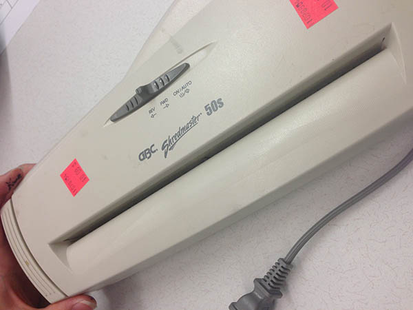
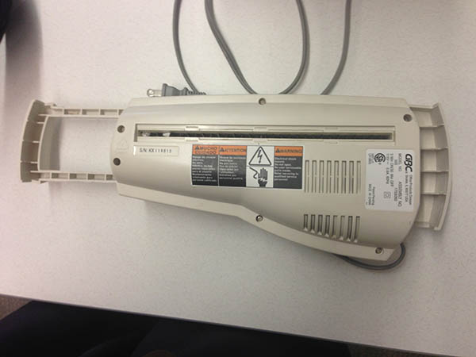
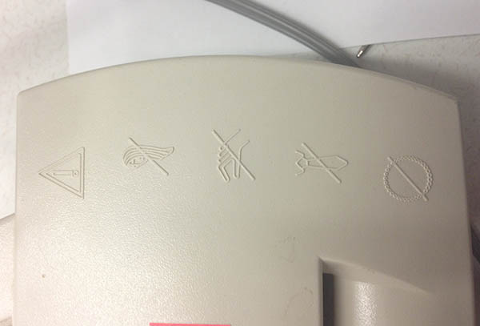
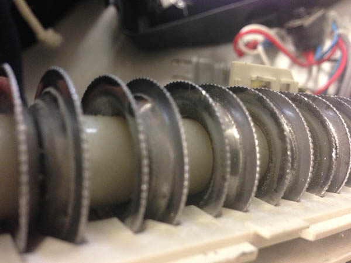
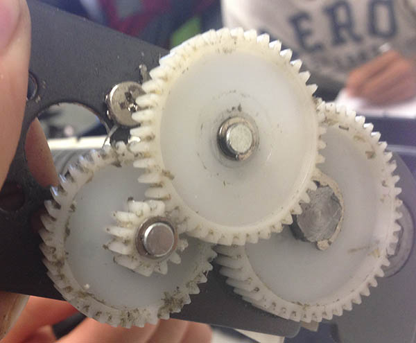
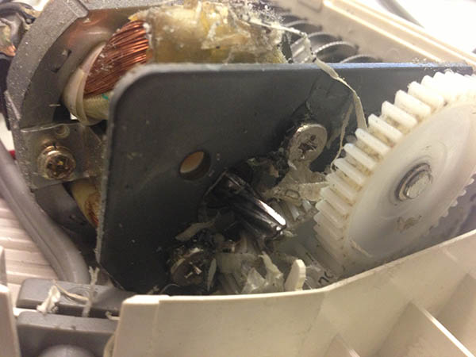

This shredder was the first aritifact me and my room mate evaluated in Praxis, and we found it mostly designed for safety and usability.

<h2 class="anchor">Design for Usability <a class="anchor-link" title="permalink to section" href="#usability" name="usability">¶</a></h2>
----------------------
Usability features are mostly external and that is what we analyzed first.  
The first feature we noticed was the sloping entrance to allow paper to be inserted at various angles.  
This effectly made the entry hole larger without actually increasing its size.

Sloped entry to guide paper

The interface is also incredibly simple, the top slider centred to grab attention and the sloped entry indicating which side to enter from.

The body of the shredder had an extendible leg to allow placement over round garbage cans for convenient disposal of waste.  
Since the legs are round, they fit garbage cans with the same curvature, which limits its robustness.  
However, the benefit of this is that the shredder will not move, conformed by its curvature.

Extendible leg to fit over garbage cans

Also seen in that picture is its relative short power cord, measuring 130cm.  
This feature falls under both usability and safety - usability for ease of carrying and safety for avoidance of tripping.

<h2 class="anchor">Design for Safety <a class="anchor-link" title="permalink to section" href="#safety" name="safety">¶</a></h2>
-------------------
For a product that shreds paper, a task that is potentially dangerous, the product has to look and be safe in order to sell.  
This shredder limits the visibility of the actual shredding to give it a safe appearance.  
There is also very clear labelling near the entry hole to remind the users of what is safe to put in.

Constant reminder of safe materials to put through

In case of accidents, the blades are dull and rely on shearing rather than cutting to shred paper.

Safe, dull blades

And in case of unexpected material, the gears are plastic and will yield to jam the shredder before the motor is damaged.

Plastic gears prevent motor damage

<h2 class="anchor">Potential Improvements <a class="anchor-link" title="permalink to section" href="#improvements" name="improvements">¶</a></h2>
----------------
The shredding area is not isolated from the motor, which could cause clogging if shreds were caught in the motor.  
Serious still is the inadequate isolation of the gears from the shredding area as they are more susceptible to clogging.  

Inadequate isolation for gears from shredding area

Another possible improvement is the replacement of screws with plastic tabs, as part of the injection molded frame.  
This greatly reduces the number of parts, decreasing its cost considerably.  
Further research is required into the feasibility of this replacement,  
since the shredding motion might be too vigorous for the tabs to handle,  
and blunt trauma such as dropping it could disasemble all the components.
