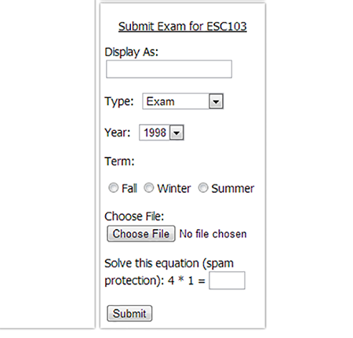

My room mate [Zhuowei](http://zhuoweizhang.net) and I explored how secure [Skule's (U of T Engineering) courses page](http://courses.skule.ca) is,  
since it is host to supposed past exams that most U of T students download without a second thought.  

This was done mostly for fun and curiosity, with no malicious intent; **preserving the pages' usability was a primary concern**.  

The pages that were pranked include: [CSC180](http://courses.skule.ca/course/?q=CSC180H1) | [ESC103](http://courses.skule.ca/course/?q=ESC103H1) | [PHY180](http://courses.skule.ca/course/?q=PHY180H1)  
In case those pages were taken down, you can see the scripts in action: [Sample ESC103](esc103.html) | [Sample PHY180](phy180.html)  

Message to all readers and possibly maintainers of Skule:  
Please sanitize input boxes before injecting content into the page; it's too easy for someone to insert an \<a\> tag redirecting to a malicious site!  

## Injecting Code (the clever part)
--------------------------------
Before altering the actual course pages, an illegitimate course was created to allow prototyping.  
Skule's search cannot find the course, but direct access through URL allows access to upload and view.  

The first page to be "improved" was CSC180, which had an iframe element injected through the "Display As" field.  
Apparently **no sanitation of inputs is done...**  

They protect against spam... But what of dirty injections!?!

The code for the CSC180 page was written by Zhuowei while I wrote the code for the ESC103 page.  
The PHY180 page's GravityScript was written by Google and we simply embedded it into the page using the method below.  

The embedding for the CSC180 page was trivial since no scripting was required,  
but adding a script for the ESC103 and PHY180 pages were much more difficult.  

Just adding a \` 
After exhausting the possibilities by splitting the string up and concatenating them like `"<scr" + "ipt>"` and escaping the characters like  
`&quot;&lt;scr&quot; + &quot;ipt&gt;&quot;` we determined that the input ate script tags, apparently.  

Our workaround was to use an impossible to load \ element that points to our script with its onerror attribute.
``  

It will always load my script because http://localhost:1 as an image can never load!

## Javascript (the dumb part)
-------------------------
I took this as an opportunity to get familiar with Javascript, seeing as I recently learned HTML and CSS for this portfolio.  
Gaining proficiency in JS will complete my skill set as a web developer, which will be widely useful since the web is becoming a larger distributor of applications.  
Web apps are robust in being 100% cross-platform, requiring just a browser to function on any OS and device, compatible with my philosophy for robustness.  

The idea was to create an effect that was immediately noticeable yet is easy to turn off to preserve usability.  
Seeing as this was our linear algebra course, I went with rotating the page, which is a linear transformation :D.  
A large button was placed in the centre of the page to make it easy for people to return the page to normal since its location will stay still.
<pre><code>var timer = setInterval(transform,50);
var degreez = 0;
var allSet = false;
var bellybutton;
function transform(){
	if (!allSet) {
		var transOrigin = "50% 50%";
		document.body.parentElement.style.height = "100%";
		document.body.style.minHeight = "100%";
		document.body.style.transformOrigin = transOrigin;
		document.body.style.webkitTransformOrigin = transOrigin;
		document.body.style.mozTransformOrigin = transOrigin;
		bellybutton = document.createElement("button");
		bellybutton.innerHTML = "CLICK TO STOP PUKING";
		bellybutton.style.position = "absolute";
		bellybutton.style.left = "45%";
		bellybutton.style.top =  "45%";
		bellybutton.style.width = "10%";
		bellybutton.style.height =  "10%";
		document.body.appendChild(bellybutton);
		bellybutton.onclick = stoppuking;
		allSet = true;
	}
	var transString = "rotate(" + degreez + "deg)";
	document.body.style.transform = transString;
	document.body.style.webkitTransform = transString;
	document.body.style.mozTransform = transString;
	degreez += 1;
}
function stoppuking(){
	clearInterval(timer);
	var transString = "";
	document.body.style.transform = transString;
	document.body.style.webkitTransform = transString;
	document.body.style.mozTransform = transString;
	document.body.removeChild(bellybutton);
}
</code></pre>

This code was designed to work on all browsers and devices (webkit, moz, and unnamed),  
and a button was chosen because it can be clicked on all devices, whereas some other mechanisms  
such as onhover aren't mobile compatible.  

Lastly, I'll leave how we changed the years to an arbitrary number as an anagram, decode it if you can:  
a cad ed retelevise fill unlit  (It is in English, has 1 verb, 1 noun, and 3 adjectives)

## Gains from Experience
---------------------------
- Javascript experience and interest in web development
- Appreciation of sanitizing inputs
- Knowledge of this issue to Skule maintainers that they may fix it
- Fun :D
