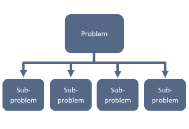
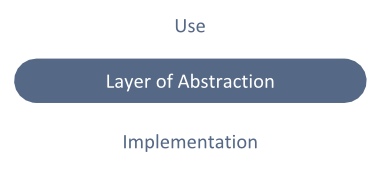
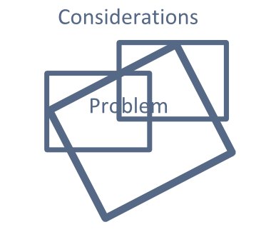
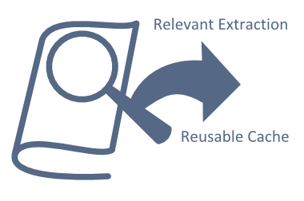
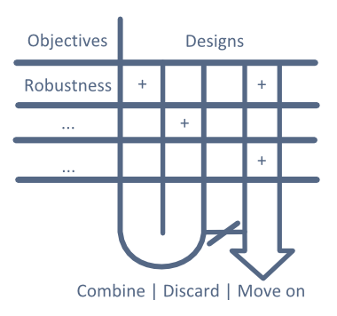
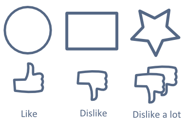

Collected here are my assessment and guideline on technical tools and teamwork strategies.
Each tool will be analyzed as to what they're 
suited for and when to use them
, 
and when 
they're not useful
 is discussed, 
and the tool is assigned a 
general usefulness score
 based on the range of situations the tool would be helpful in.
 
Teamwork strategies examine aspects of teamwork and potential causes of problems inside each and how they can be dealt with.

<a class="toc-link" href="#tools"><h3 class="toc-title">Tools</h3></a> 
<ol>
	<li><a class="toc-link" href="#decomposition">Functional decomposition</a>  
	<li><a class="toc-link" href="#wishful">Wishful thinking</a>
	<li><a class="toc-link" href="#reframe">Reframing (reconsidering the problem)</a>
	<li><a class="toc-link" href="#research">Research</a> 
	<li><a class="toc-link" href="#pugh">Pugh charts</a>  
	<li><a class="toc-link" href="#comparison">Comparison matrix</a>
<ol>

	

<a class="toc-link" href="#teamwork"><h3 class="toc-title">Teamwork</h3></a>
<ol>
	<li><a class="toc-link" href="#meetings">Meetings</a>
	<li><a class="toc-link" href="#unperformant">Unperformant team members</a>
	<li><a class="toc-link" href="#atmosphere">Team atmosphere</a>
	<li><a class="toc-link" href="#parallel">Parallel tasks</a>
<ol>

	

<h2 class="anchor">Technical Tools <a class="anchor-link" title="permalink to section" href="#tools" name="tools">¶</a></h2>
-------------------------

These are the tools I use to solve the right problem and solve the problem right.
To solve the right problem, research and reframing has to be done to refine a better understanding of what the actual problem is.
And to solve the problem right, the other tools allow me to create a modular solution whose components can be easily interchanged.
I believe this to be more important than having a perfect monolithic solution since a modular design is adaptable to a changing
environment and can be made better through iteration and alteration of parts.

###Functional decomposition

	

		

			<ul>
				<li>use in almost every situation
				<li>breaks problem into (mostly) independent subproblems
				<li>encourages modular treatment of problem
				<li>facilitates parallel task distribution
				<li>easier to focus on specific part of problem
				<li>forces consideration of what the actual problem is
			</ul>
		

		

			<ul>
				<li>approximates problem since in reality all parts are interdependent
				<li>difficulty in combining component solutions to subproblems
		

		

			9/10
		

	

	

		

			<ul>
				<li>division of <a href="/portfolio/projects/portfolio">portfolio</a> into 
				styling (CSS), content (markdown/HTML), layout (HTML/Jekyll templating), and hosting (GithubPages)
				<li>division of causes of <a href="/portfolio/projects/binder/divergentflowchart.jpg">binder misalignment</a>
				<a href="#ref1">[1]</a> into blunt trauma, misuse, and misplacement
				<li>division of the problem of <a href="/portfolio/projects/icecube">meat refrigeration without grid electricity</a>
				<a href="#ref2">[2]</a> into insulation, radiation protection from the sun, initial cooling, and meat storage
				<li>division of web development by the Django framework into models, views, and templates (MVC pattern)
				as used in the creation of <a href="/portfolio/projects/timewatch">timewatch</a>
			</ul>
		

		

			
		

	
	

 

###Wishful thinking

	

		

			<ul>
				<li>best used in software and other idealized situations
				<li>isolate consideration for use and implementation
				<li>creates layers of abstraction to manage complexity
				<li>works well with functional decomposition
			</ul>
		

		

			<ul>
				<li>assumes that implementation is in place
				<li>assumptions break down in real life due to physical laws
			</ul>
		

		

			7/10
		

	

	

		

			<ul>
				<li>any component solution following functional decomposition assumes other parts
				of the problem are taken care of
				<li>any kind of recursive procedure assumes itself is already implemented
				<li>most procedures I write operate only on 1 implementation level, calling
				lower level procedures that I assume are implemented
			</ul>
		

		

			
		

	
	

 

###Reframing problem

	

		

			<ul>
				<li>use when given a foreign problem by others
				<li>form personal understanding of problem through research and experimentation
				<li>promotes solving the right problem
				<li>results in finding easy to measure and relevant metrics
			</ul>
		

		

			<ul>
				<li>very time consuming
				<li>weakness in research and experimentation would give flawed new frame
			</ul>
		

		

			7/10
		

	

	

		

			<ul>
				<li>understanding the problem of <a href="/portfolio/projects/binder/#analysis">binder misaligment</a> <a href="#ref1">[1]</a>
				as the separate and related issue of shift misalignment and yield misalignment, sharing some common causes
				<li>selecting for a <a href="/portfolio/projects/detaileddesign.pdf">food safe material</a> <a href="#ref3">[3]</a>
				reframed to selecting for a corrosive resistent and easy to clean material, 
				further reframed to selecting for smoothness and hardness
				<li>injection of modularity and robustness into all of my projects, such as the 
				<a href="/portfolio/projects/icecube">ICE-Cube</a> <a href="#ref2">[2]</a> and the design of this handbook
			</ul>
		

		

			
		

	
	

 

###Research

	

		

			<ul>
				<li>use in almost every situation
				<li>helps understand the problem
				<li>research accumulates and can be easily reused
			</ul>
		

		

			<ul>
				<li>very time consuming
				<li>usefulness of research not guaranteed
			</ul>
		

		

			6/10
		

	

	

		

			<ul>
				<li>survey used to understand the problem of binder misalignment
				<li>contacting stakeholders in the <a href="/portfolio/projects/headset/">headset and glasses RFP</a> <a href="#ref4">[4]</a>
				and <a href="/portfolio/projects/icecube/#stakeholder">meat refrigeration without grid electricity</a> for first-hand 
				experience with the problem
				<li>often found ways to improve value of solution --> ICE-Cube combines function of display and storage, 
				an advantage over existing coolers which only store meat
			</ul>
		

		

			
		

	
	

 

###Pugh charts

	

		

			<ul>
				<li>use sparingly in the compare and select stage
				<li>compares technical performance
				<li>formalizes decision making
			</ul>
		

		

			<ul>
				<li>very difficult to remove bias in score assignment
				<li>requires large number of diverse combinations/candidate solutions
				<li>tedious and formal work that could damage team atmosphere
			</ul>
		

		

			4/10
		

	

	

		

			<ul>
				<li>informally done for choosing portfolio setup in <a href="/portfolio/projects/portfolio/#compare">comparing</a> 
				against Wix, Wordpress, and Weebly
				<li>comparison of <a href="/portfolio/projects/detaileddesign.pdf">food-safe materials</a> (Table 2)
			</ul>
		

		

			
		

	
	

 

###Comparison matrix

	

		

			<ul>
				<li>use in the compare and select stage
				<li>bias is not a problem (actually drives selection)
				<li>quick and easy
				<li>compares holistic appeal (usually more aesthetics based)
				<li>use with pugh charts to see which combinations are technically performant and which are appealing
				<li>used in combination can reveal the reasons behind a combination's performance or appeal
			</ul>
		

		

			<ul>
				<li>requires large number of diverse candidates
				<li>depends on use of formal performance comparison (such as a pugh chart) to be more effective
			</ul>
		

		

			6/10
		

	

	

		

			<ul>
				<li>informally done for each project, immediately after brainstorming diverse ideas
				<li>disagreements add value to solution since they lead to more detailed research to back up claim,
				such as my justifications for maintaining a cubic dimension for the <a href="/portfolio/projects/icecube/#dimension">ICE-Cube</a>
			</ul>
		

		

			
		

	
	

<h2 class="anchor">Teamwork Strategies <a class="anchor-link" title="permalink to section" href="#teamwork" name="teamwork">¶</a></h2>
-------------------------

These are the aspects of that are likely to cause problems. For each I will examine the 
causes

and 
remedies
.
The top box will cover causes while the bottom box covers remedies.

###Meetings

	

		<ul>
			<li>meetings without a clear purpose lead to unproductive time spent together, 
			fostering animosity between teammates and a hostile atmosphere
			<li>meetings <b>were too frequent</b>, leading to members skipping
			<li>members relied on meeting time to do their work
			<li>all these cripple a team's ability to do parallel work, making a team pointless
		</ul>
	

	

		<ul>
			<li>make clear that meeting time is only to distribute work rather than do it
			<li>make a simple checklist of things to accomplish at each meeting (be realistic)
			<li>only hold full meetings at critical points
			<ol>
				<li>first contact, establish expectations and distribute tasks 
				<li>decide on which solution to prototype
				<li>before presentation 
				<li>decide on major alteration
			</ol>
			<li>allow room for asynchronous decision making (via facebook group or google docs), rather than requiring everyone
			to be present for all decisions
		</ul>
	

###Unperformant Team Members

	

		<ul>
			<li><b>different expectations</b> from the start on what is a good job
			<li>not assigning tasks to members' strengths or giving them minor tasks that demonstrate your lack of trust
			<li>hostile team environment 
			<li>communication issues and incompetence
		</ul>
	

	

		<ul>
			<li>use the first meeting to set up expectations
			<li>take a chance with new teammates by trusting them to important tasks
			<li>maintain friendly atmosphere by keeping meetings infrequent and informal, as well as making personal connections
			<li>problem should resolve itself since reputation has a natural feedback cycle -->
			hardworkers will develop a hardworking reputation and will more likely select other hardworkers as future teammates
			while freeloaders become publicly known and are avoided
			<li>only way in dealing with current unperformant team is to take up more work yourself
		</ul>
	

###Team Atmosphere

	

		<ul>
			<li>depends on 
			<ol>
				<li>frequency and formality of meetings
				<li>past success
				<li>personal interactions
			</ol>
			<li>best established during first meeting
			<li>upkeeping is much easier than changing it
		</ul>
	

	

		<ul>
			<li>hold full meetings only when necessary
			<li>keep communication fluid (ex. facebook group, google docs) rather than static (only at meetings, either skype or in person)
			<li>avoid working with previous unperformant members
			<li>fix up bad social habits (ex. always being skeptical of others' ideas)
		</ul>
	

###Parallel Tasks

	

		<ul>
			<li>purpose of team is to accomplish a large task faster and better by division of tasks
			<li>serializing tasks indicate failing team
			<li>team relies on meetings to get work done
			<li>distribution of dependent tasks
		</ul>
	

	

		<ul>
			<li>use functional decomposition at each step to create independent subproblems
			<li>visually render tasks, either informally or formally through a Gantt chart
		</ul>
	

<h2 class="anchor">References <a class="anchor-link" title="permalink to section" href="#reference" name="reference">¶</a></h2>
-------------------------

<a href="/portfolio/projects/binder" name="ref1">[1]</a> S. Zhong et al., 
	"Shield Spring: Binder Misalignment," 
	University of Toronto, Jan. 1, 2014.	
 
<a href="/portfolio/projects/icecube" name="ref2">[2]</a> S. Zhong, K. Cota, E. Yang, and J. Zabala, 
	"ICE-Cube: Meat Refrigeration Without Electricity," 
	University of Toronto, April 12, 2014.
 
<a href="/portfolio/projects/detaileddesign.pdf" name="ref3">[3]</a> S. Zhong,
	"Food-Safe Material Selection for Aerator," 
	University of Toronto, Feb. 17, 2014.	
 
<a href="/portfolio/projects/headset" name="ref4">[4]</a> S. Zhong, K. Cota, E. Yang, and J. Zabala,
	"Request for Proposal: Reducing the Discomfort of Wearing Headsets with Glasses for Toronto Police Communication Operators," 
	University of Toronto, Feb. 17, 2014.	
 

