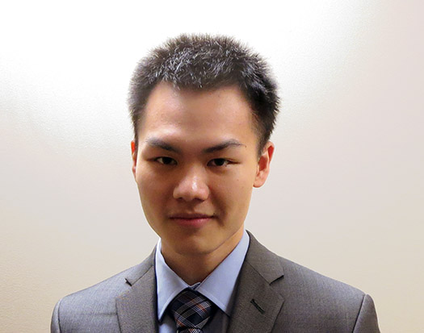

	I'm a first year Robotics PhD student at the University of Michigan in Ann Arbor.

    I grew up in China, immigrated to Canada when I was 8,
    stayed in Calgary for 10 years, did my undergrad in Toronto
    for 4 years, spent 16 months in Zurich, and now I'm in
    Ann Arbor.

    

	In my spare time, I enjoy making reusable tools, freely available on my <a href="https://github.com/LemonPi">github</a>, and
	participating in various programming competitions. 

<h2 class="anchor">Icon meanings <a class="anchor-link" title="permalink to section" href="#icon" name="icon">&para;</a></h2>

<ul>
    <li>initials of my legal name: Sheng Zhong 
    (chinese ordering is last then first, so it's pronounced Zhong Sheng)</li>
    <li>a lever representing the usage of tools to help solve problems</li>
    <li>an upward pointing diode representing progress and positive thoughts</li>
</ul>

