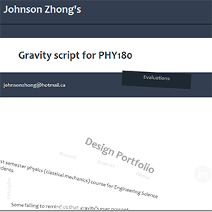

<h1 style="text-align:center;font-size:80px;">Welcome</h1>

Take a look around my engineering design portfolio,   
where I present my <a href="principles.html">conception</a> of good design and showcase my recent projects.  
 

<a href="namegame/">

<h1>Name Game</h1>
Gives you usernames and quizzes you on real names using string processing in C    
Jan 2014

</a>

<a href="skulecourses/">

<h1>Skule Security Sillyness</h1>
Exploration of skule.ca/courses/ security, code injection, and JS pranks    
Dec 2013

</a>

<a href="portfolio/">

<h1>Engineering Design Portfolio</h1>
The making of this portfolio    
Nov 2013 - present

</a>

<a href="binder/">

<h1>Binder Misalignment</h1>
Redesign of binder shields into a spring that offers a more convenient method of opening the rings    
Nov 2013

</a>

----------------------------
##Professional Statement
> ###As an engineer,
> I believe engineering design is the application of scientific knowledge to solve real problems in a robust, usable, and efficient manner with the stakeholders in mind.  
> Good engineering is a balance of fitting theoretical models and trial and error through prototyping.  
> As you consider my exploits from past to present, you can see evidence of how I progressed from oversimplifying problems to appreciating complex issues.  
> My personal strengths lie in adopting new tools and applying scientific knowledge to analyze real life situations.  