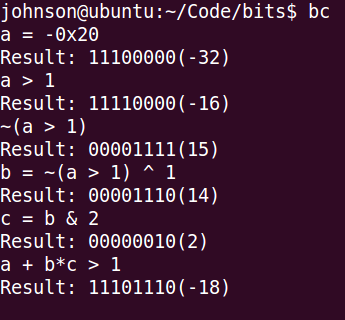
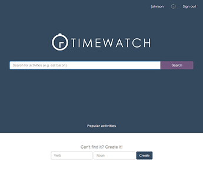
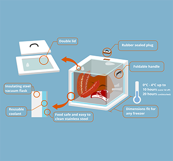

<h1 style="text-align:center;font-size:80px;">Welcome</h1>

Take a look around my engineering design portfolio,   
where I present my <a href="principles.html">conception</a> of good design and showcase my recent projects.  
 

<a href="projects/clisp/">

<h1 class="caption-title">Clisp</h1>
Lisp interpreter (scheme dialect) in C++    
Aug 2014

</a>

<a href="projects/bincalc/">

<h1 class="caption-title">Bincalc</h1>
Binary calculator for bit manipulation practice and stream processing    
July 2014

</a>

<a href="projects/timewatch/">

<h1 class="caption-title">Timewatch</h1>
Social platform and utility for trending activities and time management     
Feb 2014 - present

</a>

<a href="projects/icecube/">

<h1 class="caption-title">ICE-Cube</h1>
Meat Refridgeration without grid electricity     
March 2014

</a>

----------------------------
##Professional Statement
> ###As an engineer,
> I believe engineering design is the iterative application of scientific knowledge and technical skills to solve real problems in a robust, usable, and efficient manner with the stakeholders in mind.
  

> Good engineering is a balance of fitting theoretical models and trial and error through prototyping,  
> and it often involves breaking down the problem and inventing a language of tools at each layer for a long-lasting, robust solution.

> As you consider my exploits from past to present, you can see evidence of how I progressed from oversimplifying problems to appreciating complex issues.  

> My personal strengths lie in adopting new tools and applying scientific knowledge to analyze real life situations.  