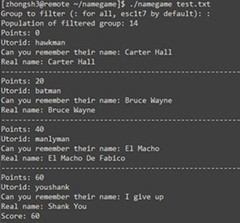
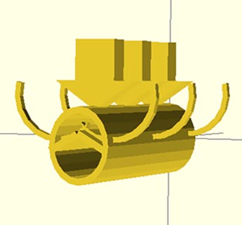

<h1 style="text-align:center;font-size:80px;">Welcome</h1>

Take a look around my engineering design portfolio,   
where I present my <a href="principles.html">conception</a> of good design and showcase my recent projects.  
 

<a href="projects/icecube/">

<h1 class="caption-title">ICE-Cube</h1>
Meat Refridgeration without grid electricity     
March 2014

</a>

<a href="projects/namegame/">

<h1 class="caption-title">Name Game</h1>
Gives you usernames and quizzes you on real names using string processing in C    
Jan 2014

</a>

<a href="evaluations/skulecourses/">

<h1 class="caption-title">Skule Security Sillyness</h1>
Exploration of skule.ca/courses/ security, code injection, and JS pranks   
Dec 2013

</a>

<a href="projects/binder/">

<h1 class="caption-title">Binder Misalignment</h1>
Redesign of binder shields into a spring that offers a more convenient method of opening the rings  
Nov 2013

</a>

----------------------------
##Professional Statement
> ###As an engineer,
> I believe engineering design is the iterative application of scientific knowledge and technical skills to solve real problems in a robust, usable, and efficient manner with the stakeholders in mind.
  
> It often involves breaking down the problem and inventing a language of tools at each layer for a long-lasting, robust solution.

> Good engineering is a balance of fitting theoretical models and trial and error through prototyping.  

> As you consider my exploits from past to present, you can see evidence of how I progressed from oversimplifying problems to appreciating complex issues.  

> My personal strengths lie in adopting new tools and applying scientific knowledge to analyze real life situations.  