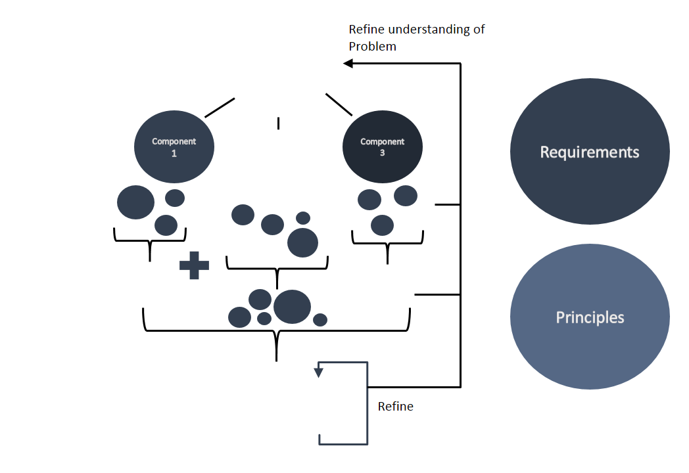

When I solve a problem, this is what I do:  

 1. Understand problem
   - Consider the **root cause** of problem to give basis for reframing
     - Physically reconstruct problem then apply physics models to analyze problem factors ([binder](/portfolio/projects/binder/#analysis))
	 - Research literature relevant to problem
	 - Set initial constraints and objectives to guide solution generation
   - Determine key stakeholders - who are most affected by this problem and what do they need/want
 2. Break problem down to its components - what needs to be done?
 3. Generate specialized solutions for each component problem (monomaniacal design) ([binder](/portfolio/projects/binder/#divergent))  
   - Relate problem to one solved in nature (biomimicry)
   - Consider what can provide forces if something needs to be moved
   - Consider buckling or bending to fold something
   - Consider friction to hold two things together but still allow for lateral shearing
 4. Compare solutions based on my [principles](/portfolio/principles.html), adjusted for what the context demands ([binder](/portfolio/projects/binder/#convergent)) ([portfolio](/portfolio/projects/portfolio/#compare))  
 5. Combine component solutions
 6. Physically prototype - allows better understanding of solution and possible issues with design ([binder](/portfolio/projects/binder/#prototype))
 7. Refine solutions
   - Can one part perform multiple functions?
   - Can two parts be combined into one?
   - How will the user interact with it?
   - How will it be stored and cleaned?
 8. Refine understanding of the problem at each step and adjust solutions accordingly
 
 With experience, certain patterns have emerged to assist each step and make the entire process more structured -  
 these are the bullets under each step.

