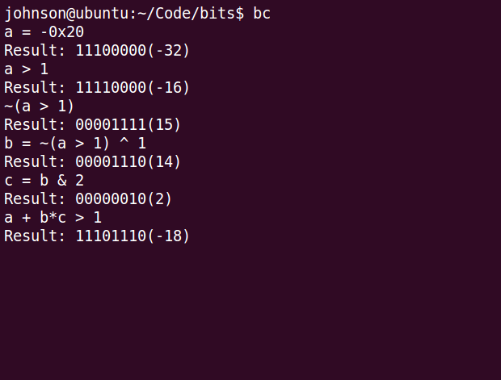
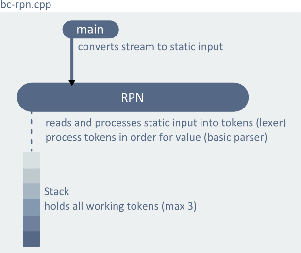
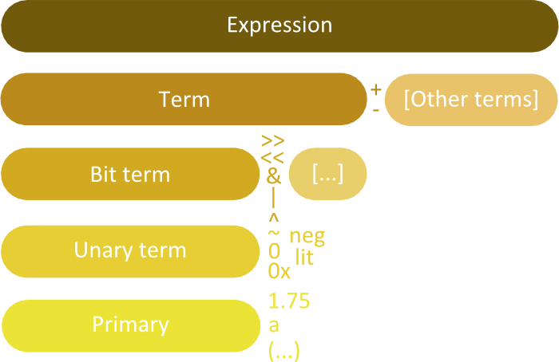
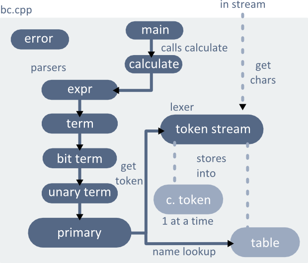
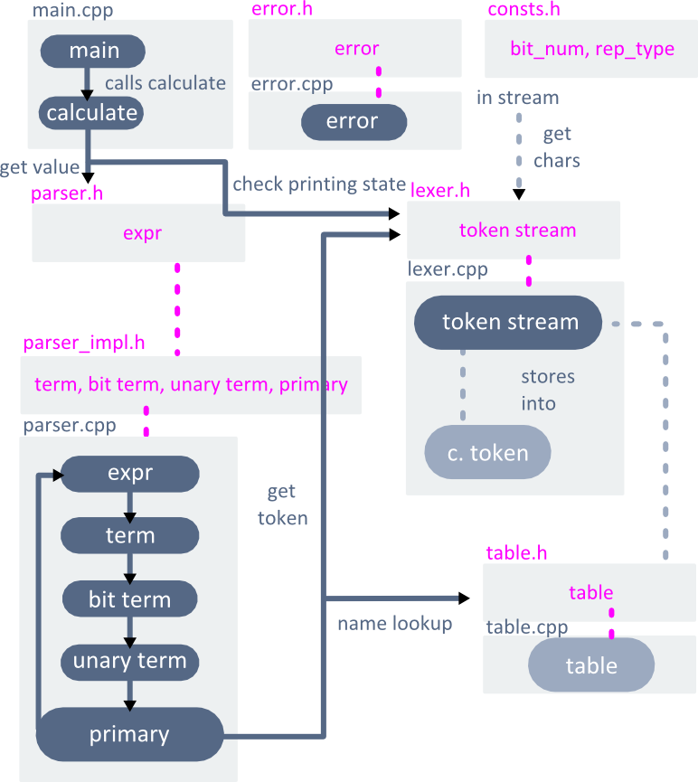

	Source on <a href="https://github.com/LemonPi/bincalc">github</a> 
	Many programming contests require performance critical solutions (like
	many real life applications), which is often provided by clever manipulation
	of bit arrays. I made this calculator to practice bit manipulation and familiarize
	myself with more C++ along the way.

                       
 

Bincalc was cross compiled from C++ to JS using [Emscripten](https://github.com/kripken/emscripten/), 
and run with [jq-console](https://github.com/replit/jq-console)

<h2 class="anchor">The Usual Tricks <a class="anchor-link" title="permalink to section" href="#tricks" name="tricks">¶</a></h2>
<table class="pretty">
<tr><th colspan=3>basics</th></tr>
<tr>
	<td>
x ^ 0 = x
</td>
	<td>
x & 0 = 0
</td>
	<td>
x | 0 = x
</td>
</tr>
<tr>
	<td>
x ^ ~0 = ~x
</td>
	<td>
x & ~0 = x
</td>
	<td>
x | ~0 = ~0
</td>
</tr>
<tr>
	<td>
x ^ x = 0
</td>
	<td>
x & x = x
</td>
	<td>
x | x = x
</td>
</tr>
<tr><th colspan=3>get, set, go</th></tr>
<tr>
	<td>
get ith bit
</td>
	<td colspan=2>
x & (1 << i)
</td>
</tr>
<tr>
	<td>
set ith bit
</td>
	<td colspan=2>
x | (1 << i)
</td>
</tr>
<tr>
	<td>
clear ith bit
</td>
	<td colspan=2>
x & ~(1 << i)
</td>
</tr>
<tr>
	<td>
filter out bits above i
</td>
	<td colspan=2>
x & ((1 << i) - 1)
</td>
</tr>
<tr>
	<td>
filter out bits below i
</td>
	<td colspan=2>
x & ~((1 << i) - 1)
</td>
</tr>
<tr><th colspan=3>least significant bit</th></tr>
<tr>
	<td>
clear least significant bit
</td>
	<td colspan=2>
x & (x - 1)
</td>
</tr>
<tr>
	<td>
check if x is a power of 2
</td>
	<td colspan=2>
x & (x - 1) == 0
</td>
</tr>
</table>

<h2 class="anchor">Instructions <a class="anchor-link" title="permalink to section" href="#instructions" name="instructions">¶</a></h2>
-------------------------------

1. Clone code from [github](https://github.com/LemonPi/bincalc) or using cmd `git clone git://github.com/LemonPi/bincalc.git`
2. Try **bc-windows** on windows, and on **bc-linux** on linux, else build it by following the rest of the steps
3. Build with `make` in the directory if you have g++(gcc) with c++11 support
4. Else either change (CC) in the makefile to your compiler of choice, or build with another tool
5. Run with `./bc` or `bc` on windows in terminal 
6. Tips:
	- exit with `Ctrl + c`
	- adjust how many binary digits is shown by changing `bit_num` in consts.h
	- 0xnum is **hex**, 0num is **oct**, and bnum is **binary**
	- change underlying type (default is double) by changing `rep_type` in consts.h

Example usage (bc is directly called because I copied it to /usr/local/bin)

<h2 class="anchor">First Version - Stack based <a class="anchor-link" title="permalink to section" href="#first" name="first">¶</a></h2>
-----------------------------------
 - stack based, requires users to use reverse polish notation (2 3 + to express 2 + 3)
 - full support for +, -, *, /, >>, <<, &, |, ^, and ~ operators
 - no support for order of operations
 - no support for variables
 - supports only positive integers
 - crash and memory leak free
 - 1 file, ~100 lines
 

	Restricting users to RPN input and not having variables were the biggest
	usability flaws. The largest technical weakness is its lack of modularity in 
	keeping everything (reading from input, processing input, error handling) in
	one giant function. This makes it hard add features since everything depends on
	everything else in the function and order matters.

<h2 class="anchor">Second Version - Grammar added <a class="anchor-link" title="permalink to section" href="#second" name="second">¶</a></h2>
--------------------------------------
 - stream based, conventional grammar
 - full support for +, -, *, /, >>, <<, &, |, ^, and ~ operators
 - full support for order of operations
 - support for variables
 - supports only positive integers
 - crash and memory leak free
 - 1 file, ~200 lines
 

	The largest usability flaw is restricting the user to positive integers (which is 
	sufficient for bit manipulation practice). Many of the first version's flaws were 
	a result of design rather than technical deficiency. Adding features to it would be
	hacky and difficult. I overhauled the design by introducing grammar, which naturally
	implements order of operations. Rules of grammar:

 - everything is an expression
 - every expression is a term optionally +/- other terms
 - every term is a bit_term optionally *// other bit_terms
 - every bit_term is a unary_term optionally >>/<</&/|/^ other unary_terms
 - every unary_term is a primary optionally ~/literal itself (later I will add negative, hex, and oct)
 - every primary is either a number, name, parentheses enclosed expression, or a unary operator symbol
 

	The grammar is intuitively and efficiently handled by a <b>recursive descent parser</b>
	(inspired by Bjorne Stroustrup's desk calculator in The C++ Language 4th edition, chapter 10.2).
	Each level of the parser calls the next,
	with each level applying its rules and returning its value. 
	For example, in expr(), it expects at least a base term
	<code>rep_type left = term(need_get);</code>
	and adds or subtracts all additional terms it can
	<pre><code>while (true) {
    switch (ts.current().kind) {
        case Kind::plus: left += term(true); break;
        case Kind::minus: left -= term(true); break;
        default: return left;
    }
}</code></pre>
	Separation of concerns and keeping it modular makes adding features and 
	understanding the code much easier. Here, expr() doesn't have to worry about
	the implementation at the lowest level, it just needs term() to follow the 
	rules and return the value of a term. This sort of intuitive logic propagates
	all the way down to the lowest level, prim(), where actual parsing of values happen.

	prim() ultimately needs to tokens to parse, which comes from the lexer.
	The lexer's job is to process state and value information from a input stream into tokens.

	The other components include a table/dictionary to hold name-value information
	for variables, a simple error handling function, and a driver to start the parser.

<h2 class="anchor">Third Version - Files separated <a class="anchor-link" title="permalink to section" href="#third" name="third">¶</a></h2>
-----------------------------
 - stream based, conventional grammar
 - full support for +, -, *, /, %, >>, <<, &, |, ^, ~, !, and ** operators
 - full support for order of operations
 - support for variables
 - supports real numbers with decimal, octal, and hexadecimal bases
 - crash and memory leak free
 - 12 file, ~300 lines
 

	The missing features of the second version were easily added due to the modular design.
	The feature complete second version had no usability flaws, but it could be improved
	technically by enforcing modularity further from separation of functions to separation
	of files. The interface could also be removed from the implementation by separating
	header and source files.

	As the diagram shows, each part relies only on other parts' interface, never their
	implementation. Version 2 roughly had this, but version 3 strictly enforces it.
	The conceptual benefits include more abstraction (without overhead) and modularity,
	making it easy to understand and add features. The technical benefits include
	stronger error safety and faster compile time, since files that haven't changed doesn't
	need to be recompiled. These benefits are much more important as project sizes scale up.

<h2 class="anchor">Gains from Experience <a class="anchor-link" title="permalink to section" href="#gains" name="gains">¶</a></h2>
-----------------------
 - C++ experience
 - Language processing experience
 - Appreciation for C++'s offering of abstraction without overhead (fast and elegant code)
 - Bit manipulation practice
 
 

