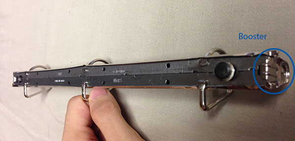
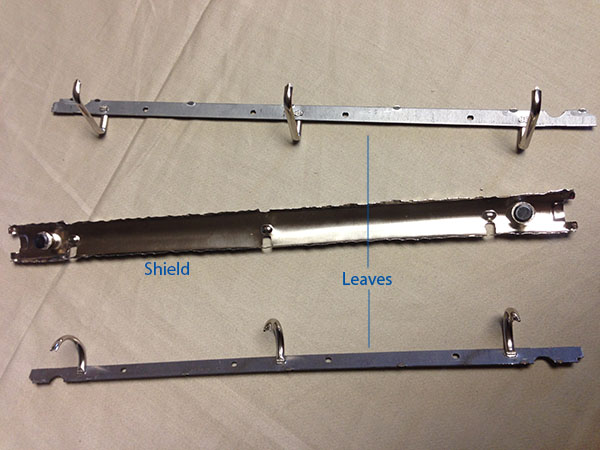
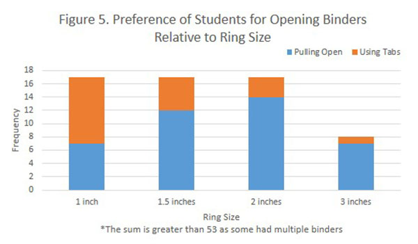
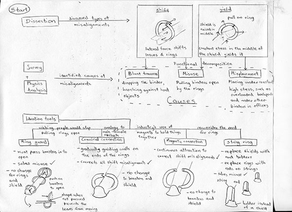
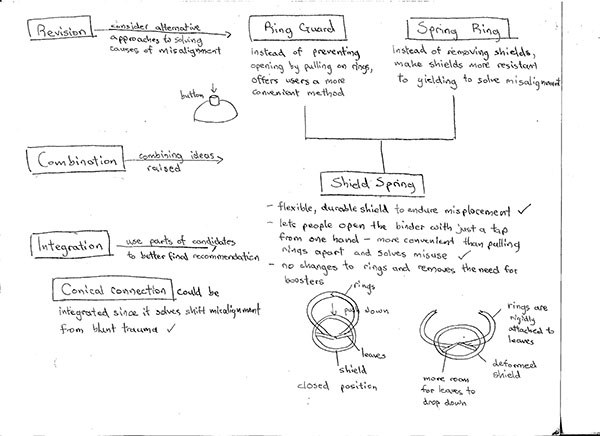
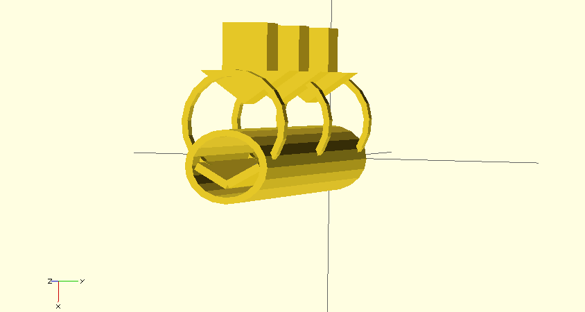
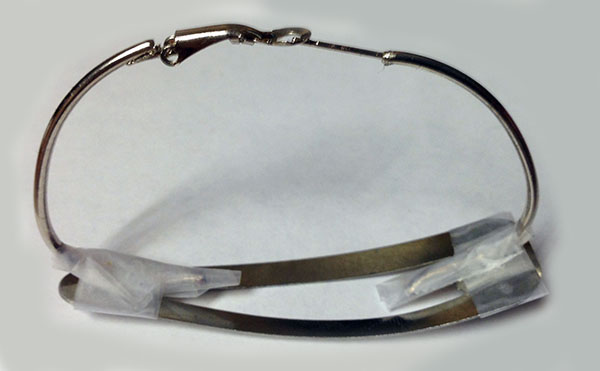
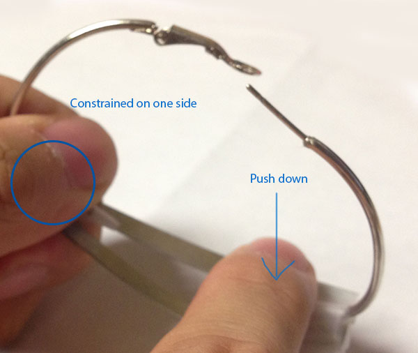
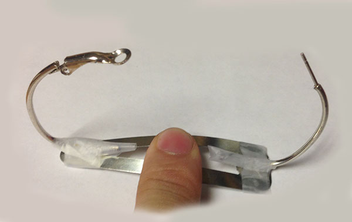

In a team of three, we considered how to solve the problem of binder misalignment.  
Check out my team mates' documentation of their work on this project: [Cameron](http://cameronbuttazzoni.wix.com/design#!bringing-a-product-to-life/c228d) [David] (http://dasburey.wix.com/design-portfolio#!product-design/cfhz)  

A typical misalignment

<h2 class="anchor">Understanding the Problem <a class="anchor-link" title="permalink to section" href="#analysis" name="analysis">¶</a></h2>
-------------------------

In line with my engineering process, me and Cameron first dissected the binder first to analyze the root causes of misalignment.

Back of binder spine with labelled booster

The binder spine contains two leaves, rigidly attached to rings, that are moved up and down by the booster.  
The spine's middle section was surprisingly easy to yield, and we found yielding it there caused misalignment.  

Spine dissected: one shield with two leaves

Blunt trauma such as dropping the binder or a force parallel to the length of the spine could shift the  
relative position of the leaves, causing another kind of misalignment.  
We then decomposed the larger issue of misalignment into two components: **yield** and **shift** misalignment. 

The next step was determining how misalignments are caused in the context of our stakeholders: students and office workers.  
I suggested framing the issue in terms of the forces required to open a binder.  
From anecdotal experience, many people pulled binders open as it was easier to  
do so since the rings were taller than the booster, translating into a larger  
lever arm, meaning it took less force to produce the same torque required to open.  
We then conducted a survey to check this hypothesis.

 
As binder ring size increased, people tended to open them more often by pulling open.  
This provides support for my lever arm hypothesis.  

We performed similar research to determine other main causes of misalignment

- misplacement inside overloaded backpacks could cause yield misalignment over time  
- blunt trauma could cause shift misalignment  

We produced candidate solutions aiming to solve a single cause of misalignment,  
following my engineering process's monomaniacal design step.

Flowchart illustrating divergent process

<h2 class="anchor">Converged Solution - Shield Spring <a class="anchor-link" title="permalink to section" href="#convergent" name="convergent">¶</a></h2>
-------------------------------------
After generating the solution pool, we considered the advantages and disadvantages of each solution.  
As may happen, we deemed the solutions inadequate, although noting that Conical Connection deals well with shift misalignments.  
Another iteration of generation was required, but reducing misuse (pulling on the rings) became the top priority.

We revised the approach to solving the causes of misalignment, which produced good component solutions when  
applied to the Ring Guard and Spring Ring candidate design.  

We then combined the two component solutions, along with Conical Connection into the Shield Spring.

The **spring shield targets usability**, as our goal was to change people's preferred mechanism of opening binders.  
By being able to open and close the binder with a simple push with one hand, people will be less inclined to pull on the rings.  
This solution is also extremely robust, as its functionality solely depends on the material property of the shield,  
rather than the presence of gravity, direction of push, or any other environmental factor.  

Flowchart illustrating convergent process

<h2 class="anchor">Prototyping <a class="anchor-link" title="permalink to section" href="#prototype" name="prototype">¶</a></h2>
--------------------
Prototyping is an essential part of my engineering design process,  
and as such I took up the responsibility of producing our prototypes.  

Each prototype was built around a **purpose**, as shown below.

Medium fidelity conceptual prototype

[Built and designed](https://gist.github.com/LemonPi/7846642) with OpenScad (Which I learned over a few hours for this purpose)

Low fidelity physical functional prototype that I built to demonstrate feasibility.  
The prototype illustrated how the shield could provide the function of the leaves,  
thus the leaves and the boosters could be removed, making the solution more efficient.

Closed position

With both sides constrained, a force buckles the spine from configuration to configuration

Opening with a push

There are two stable states of buckling, and a push transitions between the two

Open position

Close with the same push, with both sides constrained (in this case by the table)

Closing with a push

<h2 class="anchor">Gains from Experience <a class="anchor-link" title="permalink to section" href="#gains" name="gains">¶</a></h2>
--------------------
- Learned how to solid model and animate with OpenScad
- Gained physical prototyping experience
- Refined process: create a solution pool then combine component solutions
 