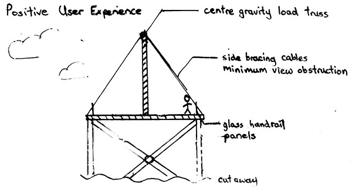
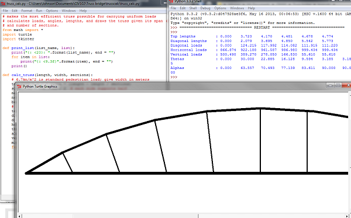
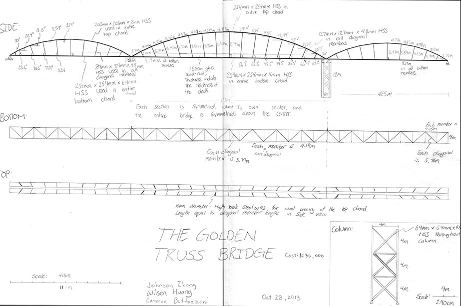

In a team of three, our task was to design and present our design of a pedestrian truss bridge to cross 150m.  
This was one of my first projects, when I valued efficiency and elegance most, but without a tangible definition for elegance.  
Check out my team mates' documentation of their work on this project: [Cameron](http://cameronbuttazzoni.wix.com/design#!conceptual-bridge-design/cr7l) [Wilson] (http://wilson1039.wix.com/praxis101#!past-projects/c1j8l)  

For efficiency, the idea was to create a safe bridge with the least cost.  
This minimalistic approach lent into our design for elegance, which meant not obstructing the scenic view for pedestrians.  
To accomplish both of these objectives, I proposed the design of a single truss down the  
centre with only wire bracing on the sides. This minimized the surface area of the bridge  
pedestrians would see when looking out to the side, and uses less material than all other teams'  
designs with two side trusses.  

Front view of 1-truss design

To achieve minimal material use for the top chord, all the members should be under the same compressional force,  
naturally dictating an arch design where the slope of successive members decrease.  
We also had to decide how many sections to have and how long to make each section.  

Rather than calculating each configuration by hand - which is extremely tedious due to all members being sloped,  
I wrote [**a program**](https://github.com/LemonPi/trusscalc) to quickly iterate through the forces, lengths, and angle of each member.  
Since we also had to do a scaled engineering drawing of the bridge and needed confirmation that my calculations were self consistent,  
I expanded my program to also draw the truss to scale using Python's turtle module.  

Calculations and scaled diagram with code

The pitfall of this design is its lack of robustness in responding to various loading conditions.  
Our design was more beyond our scope to analyze fully, thus we could not compute midspan deflection or natural frequency.  
This influenced my principles towards designing for robustness and less for efficiency - a balance needs to be struck.  

My involvement in this project includes the design and calculation; the report and most of the engineering drawing were done  
by my two team mates.  

[Design report](designreport.pdf)

Engineering drawing of the Golden Truss bridge

## Gains from Experience
-----------------------
- Principles: introduced designing for robustness
- Principles: lowered the importance of desiging for efficiency
- Experience in applying python to solve problems
- Principles: definition of elegance for structures as not obstructing the surrounding view