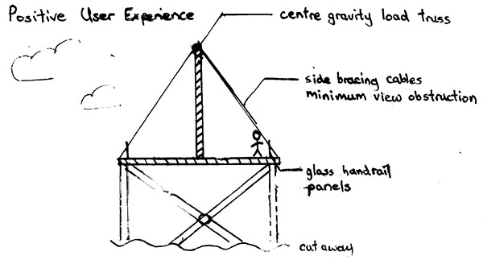

In a team of three, our task was to design and present our design of a pedestrian truss bridge to cross 150m.  
This was one of my first projects, when I valued efficiency and elegance most, but without a tangible definition for elegance.  

For efficiency, the idea was to create a safe bridge with the least cost.  
This minimalistic approach lent into our design for elegance, which meant not obstructing the scenic view for pedestrians.  
To accomplish both of these objectives, I proposed the design of a single truss down the  
centre with only wire bracing on the sides. This minimized the surface area of the bridge  
pedestrians would see when looking out to the side, and uses less material than all other teams'  
designs with two side trusses.  

Front view of 1-truss design

To make 

Engineering drawing of the Golden Truss bridge

[Design report](designreport.pdf)
[Truss calculation and drawing code](https://github.com/LemonPi/trusscalc)

## Gains from Experience
-----------------------
- Principles: lowered the importance of desiging for efficiency