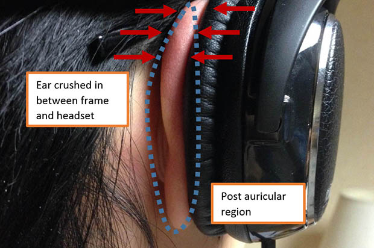
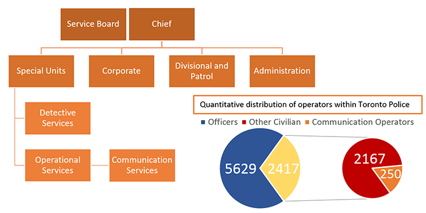

	A request for proposal (RFP) looking at the discomfort of wearing headsets and glasses,
	especially for Toronto Police communication operators who must wear them for 8 hours straight.

	Full RFP <a href="headsetandglasses.pdf">here</a>

	I was responsible for the introduction sections, most of the requirements, most of the editing, and creating all the visuals.
	Check out my team mates' documentation of their work on this project:  
	<a href="http://jingboyangdesign.weebly.com/headset-discomfort-rfp.html">Eric</a> | 
	<a href="http://kimcota95.wix.com/portfolio#!reflection/c1e75">Kim</a> | 
	<a href="http://jzabaladesignportfolio.weebly.com/">Jessa (hasn't updated yet)</a>

Problem illustrated

<h2 class="anchor">Problem Overview <a class="anchor-link" title="permalink to section" href="#overview" name="overview">¶</a></h2>
-------------------------

	My entire class was tasked with finding an interesting community that could use
	our help to improve their lived experience. I chose the communication operators because the department

 - has a clear hierarchy and access point so engaging with them is straightforward  
 - has a history of endorsing ergonomic centred design for their workers  
 - faces increasing number of calls with declining number of operators  
 - has a unconventional shift schedule that introduces lots of opportunities for improvement  
 - potential problems are likely mechanical and thus are approachable for first year engineering students
 

	My team agreed with my points and selected this community in favour of three other ones.

	We distributed tasks such that I was responsible for contacting the community and researching community details.
	I eventually secured a visit to the Public Safety Answering Point (call center) after many emails, calls, and a background check -
	more hassle for contact than I anticipated!

	At the call center, Kim noticed and suggested we investigate the discomfort of wearing
	headsets and glasses together, as operators must wear them for 8 continuous hours.
	When asked, most operators confirmed the discomfort and that they had to contacts or 
	change glasses because of it, which caused problems of itself.

	I believe this problem is highly suitable for us to explore because it

 - provides room for diverse solutions
 - is a small mechanical problem that could be solved with first year engineering science knowledge
 - is very expandable in scope -> solution could be useful for anyone who wears glasses and headsets

<h2 class="anchor">RFP Reflection <a class="anchor-link" title="permalink to section" href="#reflection" name="reflection">¶</a></h2>
-------------------------

	The requirements is the most important section of any RFP and also the difficult to get right.
	Good requirements can only come after the problem has been well understood in <b>physical</b> (forces),
	<b>logistical</b> (what resources are avaible or not), and <b>social</b> (how does the social environment influence the problem) 
	terms. In an RFP, this understanding partially frames the problem and should be presented first in the RFP, 
	embedded in the abstract, introduction (in our case community details), problem definition, and stakeholder explanation.

	After the full understanding, high level objectives can be formed, which then each branch out into 
	detailed objectives that can be more directly measured. I was responsible for finding metrics and constraints 
	for our RFP, and it was very time and research intensive, but rewarding. Below is our high level objectives 
	and the table of detailed objectives.

 1. Must reduce or eliminate discomfort caused by wearing glasses together with headsets for all operators wearing glasses.  
 2.	Must not hinder any operators from performing their task.  
 3.	Should be compatible with existing equipment and budgets.  

<table class="pretty">
<tr>
	<th>
Detailed Objective
</th>
	<th>
Metric
</th>
	<th>
Criteria
</th>
	<th>
Constraint
</th>
</tr>
<tr>
	<td class="bar" colspan="4">
High Level Objective 1
</td>
</tr>
<tr>
	<td>
Accomodate different ear sizes
</td>
	<td>
Height and width of ear supported (in)
</td>
	<td>
Wider range is better
</td>
	<td>
Height: 2.7"-2.9" Width: 1.5"-1.7" 99% of population lies in this range
</td>
</tr>
<tr>
	<td rowspan="2">
Minimize strain on ear
</td>
	<td>
Weight (g) of solution with headset
</td>
	<td>
Less is better
</td>
	<td>
<36g - weight of average headset in use
</td>
</tr>
<tr>
	<td>
Decrease in maximum pressure (kPa) on all parts of the ear compared to current setup
</td>
	<td>
More is better
</td>
	<td>
>14% decrease – boundary of noticeable difference for static pressure
</td>
</tr>
<tr>
	<td>
Prevent moisture buildup in ear
</td>
	<td>
Increase in relative humidity (%) over 8 hour shift
</td>
	<td>
Lower is better
</td>
	<td>
<20% - the difference between normal and infected ears
</td>
</tr>
<tr>
	<td class="bar" colspan="4">
High Level Objective 2
</td>
</tr>
<tr>
	<td rowspan="2">
Preserve incoming and outgoing sound quality
</td>
	<td>
Range of intelligibility (dB) caller volume range, measured on their phone, that can be accurately heard by operator
</td>
	<td>
More is better
</td>
	<td>
>20dB - difference between quiet whispering and normal conversation
</td>
</tr>
<tr>
	<td>
Level of operator background noise heard by caller (dB)
</td>
	<td>
Lower is better
</td>
	<td>
<50 dB
</td>
</tr>
<tr>
	<td>
Prevent operators having to adjust headset
</td>
	<td>
Average times (number) adjustment required per 8 hour shift
</td>
	<td>
Lower is better
</td>
	<td>
<3 - one for each scheduled break
</td>
</tr>
<tr>
	<td class="bar" colspan="4">
High Level Objective 3
</td>
</tr>
<tr>
	<td>
Be compatible with different glass frame sizes
</td>
	<td>
Range of lens widths supported (mm)
</td>
	<td>
Larger is better
</td>
	<td>
44mm-52mm lens width frames
</td>
</tr>
<tr>
	<td>
Be within equipment budget
</td>
	<td>
Wholesale cost ($)
</td>
	<td>
Less is better
</td>
	<td>
<$13,300 for all operators – communication equipment budget of 2014
</td>
</tr>
<tr>
	<td>
Be compatible with exisitng headsets
</td>
	<td>
Number of headset models compatible
</td>
	<td>
More is better
</td>
	<td>
>0 - at least one headset should work with solution
</td>
</tr>
</table>

	As you can see, the requirements are very comprehensive and relevant to this problem.
	However, our RFP was not selected as one of the 8 RFPs to give out to teams 
	to pursue solutions. I believe this is because of the difficulty in measuring
	decibles (dB), which was included in a lot of metrics.
	This illustrates that strong requirements are ones that are <b>comprehensive, relevant, and
	easy to measure</b>. 

	The clearest area of improvement if we had more time is to specify a 
	standard procedure for testing candidate solutions. In the current state,
	different teams could use drastically different means to measure for sound quality 
	and the results would be unreliable to the point of being useless.

<h2 class="anchor">Gains from Experience <a class="anchor-link" title="permalink to section" href="#gains" name="gains">¶</a></h2>
-----------------------
 - Experience in contacting communities and finding opportunities
 - Experience in creating meaningful visuals
 - Appreciation of requirements' importance and what makes for strong requirements