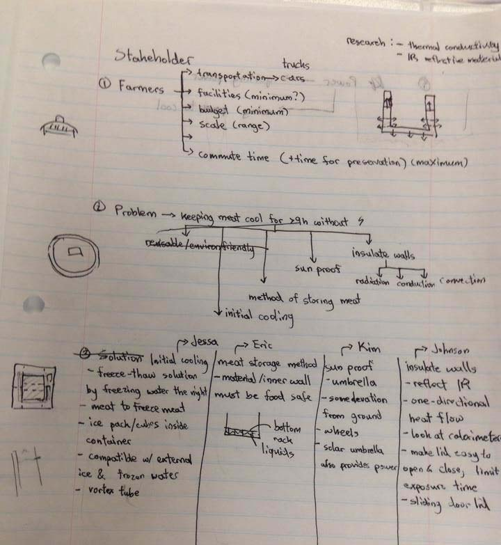

	In response to the <a href="meatrefridgeration.pdf">request for proposal</a> 
	for keeping meat between 0°C to 4°C, my team created the ICE-Cube - a 
	modified cooler that combines storing and displaying meat as well as making the two tasks
	more convenient. The concept managed to draw the attention of Globe and Mail.

	Globe and Mail coverage of it <a href="">here (story not written yet)</a>

	One page description of it <a href="onepager.pdf">here</a>

	I was responsible for generating the overall concept, justifying key features, creating the poster, and a third of the work on our prototypes.
	Check out my team mates' documentation of their work on this project:  
	<a href="http://jingboyangdesign.weebly.com/ice-cube.html">Eric</a> | 
	<a href="http://kimcota95.wix.com/portfolio#!projects/cy2g">Kim</a> | 
	<a href="http://jzabaladesignportfolio.weebly.com/artifact-six-ice-cube.html">Jessa</a>

<a href="poster.pdf">

ICE-Cube Poster illustrating key features (click for full version)

</a>

<h2 class="anchor">Design for Usability <a class="anchor-link" title="permalink to section" href="#usability" name="usability">¶</a></h2>
-------------------------

	The main feature is that water can be poured in between the containing and insulating cube,
	put in the freezer over night and frozen into a solid cube of ice the next morning.
	This eliminates the need to buy and replace ice in conventional coolers.

Pouring water into plug of first prototype

	 
	Another distinguishing feature is the cube's double lid.
	The inner lid is transparent (made of pyrex glass), allowing the 
	cube to both display and store the meat. The outer lid would 
	only be used for under-the-sun use and during storage.

Looking through transparent lid of second prototype

	 
	The dimension of the cube also contributes to its usability by 
	fitting inside most kinds of freezers, limiting the maximum weight, 
	and encouraging categorized placement of meat.

	The Cube was designed for robustness in that it targets a wide market.
	It is suitable for personal as well as commercial use. As such the size of the
	Cube ensures fit into minimum sized chest freezers and the top of refrigerators, 
	as well as stacking inside larger models with room to spare for other items.

Top of a refrigerator with room to spare (lid should be off)

	 
	The cube is 36x36x36cm on the outside, 30x30x30cm (27L) on the inside,
	and is predicted to be at most 35kg. Research shows this as the 
	maximum weight a person can lift without risk of injury, despite the
	150lb (68kg) claim by the RFP. 

	The limited volume is a necessity for limiting maximum weight, but 
	is also a benefit in encouraging categorized placement of meat. 
	Large scale farmers can put one type of meat into each cube, increasing 
	the ease of finding for both the farmer and the customer. 

Summary:  

- eliminates need for buying and replacing of ice, now just pour water once
- double lid for Cube to display and store meat at same time
- size fits most freezers and limits maximum weight so one person can carry it

<h2 class="anchor">Design for Safety <a class="anchor-link" title="permalink to section" href="#safety" name="safety">¶</a></h2>
-------------------------

	As mentioned above, the maximum weight of an ICE-Cube is 35kg 
	when fully loaded. This safety feature prevents physical injury 
	without sacrificing any benefits of a larger container.

	Another concern of safety was meat-coolant contact.
	Gel-packs were a danger when punctured, and ice cubes increased moisture 
	when melted. Moisture is proportional to bacterial growth so should be avoided.

	Our solution was to isolate the coolant from the meat with the container wall.
	Any would physically isolate the two sides, but the inner wall also had the job
	of conducting heat so that the meat and surrounding ice wall remained at the same temperature 
	and the coolant would freeze quickly when placed in a freezer.

Inside of second prototype, aluminum container wall

	 
	We would use AISI 316L grade stainless steel with #2B finish
	for the final product. This choice is predicated on my previous 
	<a href="/portfolio/projects/detaileddesign.pdf">research on material selection</a>
	in which I found this to be the most food safe material.
	It is corrosive resistent, needed as it will be in contact with meat, and
	has a very hard surface, making it scratch resistent and easy to clean. 

	One sacrifice is strength (ability to withstand high stresses), 
	which should not be relevant since it won't be under heavy loading.
	Another sacrifice is thermal conductivity (16 W/mK) compared to aluminum (205 W/mK).
	This is inevitable since aluminum is too soft, scratching too easily, leaving 
	crevices for bacterial growth.

	Another reason for this choice is that the insulating wall 
	should be made of this material as well, to avoid stresses 
	due to difference in thermal expansion. Stainless steel is a 
	near perfect infrared reflector <a href="#ref1">[1]</a>.

Summary:
 
 - isolates coolant and meat to prevent leak and moisture build up  
 - prevents physical injury by limiting maximum weight to 35kg  
 - AISI 316L stainless steel with #2B finish is corrosive resistant and hard to scratch, making it easy to clean and durable  

<h2 class="anchor">Design for Efficiency <a class="anchor-link" title="permalink to section" href="#efficiency" name="efficiency">¶</a></h2>
-------------------------

	There is thermal effiency and use efficiency in this problem.
	The first deals with energy loss rates while the second deals with
	how much work the user needs to do to setup and transport the ICE-Cube.

	For thermal efficiency, surface area is key to minimize losses.
	The RFP discounted ice cubes as a solution due to it melting too fast, 
	resulting from its large surface area. The ICE-Cube has a single block 
	of ice surrounding the container wall, maximizing useful surface area 
	(contact with the container wall) and minimizing useless surface area (in between 
	pieces of ice). The insulating wall protects the ice from radiation via 
	stainless steel's reflection, and from conduction via either a vacuum 
	or foam inside the insulating wall.

	Another factor is the drop in frequency of opening the cube due to the double lid as
	customers no longer have to open the lid to see the meat inside.
	This feature also increases use efficiency as farmers can find the 
	correct cut of meat quicker when they can see the contents without opening the lid.

	For use effiency, ICE-Cube requires only placement inside a freezer the night before.
	The water inside can be poured once and reused in freeze-thaw cycles.
	Because the container wall is conductive (stainless steel), there is large 
	thermal transfer through it when the lid is open, ensuring freeze within 5 hours.

	Transportation times will also be cut since the Cube is personally operable, 
	removing the need to wait for help in carrying heavy containers.
	Thus the Cube offers much greater use effiency than existing solutions.

Summary:  

- one solid block of ice has best volume/surface area ratio, minimize losses compared to smaller ice cubes
- transparent inner lid decreases frequency of opening, less thermal transfer
- fast to transport by one person, save time on ice restocking
- conductive inner cube material keeps entire body the same temperature, also freezes faster

<h2 class="anchor">Design Process <a class="anchor-link" title="permalink to section" href="#process" name="process">¶</a></h2>
-----------------------

	We first met with our stakeholders (meat farmers) at the Wytchwood Farmer's market
	to observe existing solutions and what they would value.
	We found that most of them were using coolers with either ice packs or ice cubes 
	inside, and all had opaque lids. One farmer brought a chest freezer, which had a 
	transparent top, which I thought (and they agreed) was highly valuable.
	What surprised me was how different the farmers were in terms of resources
	<ul>
		<li>Some had only cars for transportation, others had trucks.
		<li>Some used 100 gallon coolers while others used 20L ones.
		<li>Some had walk in freezers and others didn't, despite them selling 100 gallons at a time
	</ul>
	This reinforced the need for a robust solution that would work across scales.

	I first functionally decomposed two things
	<ol>
		<li>stakeholder resources
		<li>problem
	</ol>

Functional decomposition and initial solution divergence

	 
	Stakeholder resources would dictate what the solution can assume.
	For example, the scale of a solution can't be too large since 
	some farmers have only cars for transportation (no trucks).

	I converged to the idea of a cooler with a coolant wall rather 
	quickly, partly due to the restrictiveness of the RFP.
	After exploring other options, including quickly ruling out 
	all powered solution, my team decided to pursue the ICE-Cube concept.

<h2 class="anchor">Prototyping <a class="anchor-link" title="permalink to section" href="#prototype" name="prototype">¶</a></h2>
-----------------------

	This project heavily involved prototyping since it was 
	the best way to credibly illustrate concept and feasibility,
	especially for a live presentation.
	And in line with the iterative nature of my design process, we made 2 prototypes.

	The first prototype's purpose was to
	<ul>
		<li>show shape, size, and look
		<li>partly demonstrate function
		<li>test how different types of meat fits
		<li>test how well it fit different freezers
	</ul>

Starting materials for the first prototype

	Foam was chosen because it is easy to prototype with.
	We also planned to use contact cement to adhere walls.
	That was a mistake.

Contact cement (and many other things) dissolve foam

	The container cube was also made of foam since we didn't 
	consider the advantages of making it conductive, and foam was easier to work with.
	The sides were lined with plastic bags, carefully taped down to water-seal it.

Plastic wrapping attempts to water seal prototype

First prototype beautifully finished

	Unfortunately it leaked and so could not fulfil the intended functional purpose.
	However, it did accomplish the conceptual and visual demonstration purposes.
	We also tested it against the freezer on my floor, which proved it was too large.

Cube too big even after removing rack

Changes from first to second prototype:  

- container wall now conductive aluminum
- size reduced to fit more freezers (originally 40x40cm base to 36x36cm)
- reduced wall thickness (4.5cm to 2cm for insulating and 1cm to 1mm for container wall)
- made lid

	The second prototype's purpose as to
	<ul>
		<li>demonstrate full function
		<li>demo process for use at showcase (live presentation)
		<li>show advantage of double lid
		<li>show refined shape and material usage
	</ul>
	The insulating cube would be made using a similar method.
	The only question was how the container cube is to be made.

Candidate 1 - thin plastic box covered with aluminum foil

Candidate 2 - plastic hangers ready to be twisted into frame for aluminum foil

Candidate 3 - foam frame with chicken wire reinforced aluminum foil

	My original vision was to use a solid aluminum or steel sheet, but
	none of the machine shops I contacted showed any promise. I was about
	to go with candidate 3 until a classmate, <a href="http://fady-andraws.wix.com/andraws-design">Fady</a>, 
	pointed out where I could find aluminum sheet.

	Prototyping was then a matter of cutting, folding, epoxy for adhering, and silicone for sealing.

Final prototype - folded aluminum sheet

Finished container box with tape for holding while epoxy dried

<h2 class="anchor">Testing <a class="anchor-link" title="permalink to section" href="#testing" name="testing">¶</a></h2>
-----------------------

	This is the first project that I took a concept to the testing phase.
	It proved very successful, as our second prototype managed to maintain
	a steady <b>1.9°C for over 9 hours</b> with opening every 15 minutes.

Testing without meat for 9 hours - steady 1.9°C

<h2 class="anchor">Gains from Experience <a class="anchor-link" title="permalink to section" href="#gains" name="gains">¶</a></h2>
-----------------------
 - Experience taking concept all the way to testing
 - Experience in creating meaningful visuals
 - Experience in prototyping
 - Experience engaging with stakeholders and the media
 
<h2 class="anchor">References <a class="anchor-link" title="permalink to section" href="#reference" name="reference">¶</a></h2>
-------------------------

<a name="ref1">[1]</a> McGuire F. M. 
	<i>Thermal & Solar Reflectance of Stainless Steel</i> [Online]. Available:
	<a href="http://www.metalresources.net/images/stories/PDF%20Pages/SAVE_ENERGY_SolarReflectance.pdf">http://www.metalresources.net/images/stories/PDF%20Pages/SAVE_ENERGY_SolarReflectance.pdf</a>

