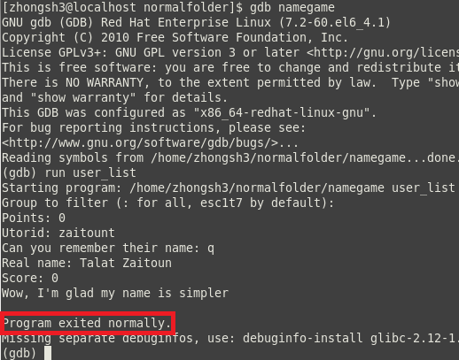

Source on [github](https://github.com/LemonPi/LameNameGame)  
I made this game to explore string processing in C, which my CSC190 professor specifically mentioned not to do.  
The game requires a Unix based user list and quizzes you on the user's real names given their username. 

## Instructions 
------------------------
1. Clone code onto your computer from [github](https://github.com/LemonPi/LameNameGame) or using cmd <pre><code>git clone git://github.com/LemonPi/LameNameGame.git</code></pre>
2. Get user list from shared computer (Unix based)  <pre><code>cp /etc/passwd ./user_list </code></pre> 
3. Compile game using gcc or clang <pre><code>gcc -std=c99 -o namegame namegame.c</code></pre> or <pre><code>clang -o namegame namegame.c</code></pre>
4. Run game with first argument being the unix user list  <pre><code>./namegame user_list</code></pre>   
5. Apply group filter (your classmates are all in the same group) 
6. Guess their names!  

Quite simple in concept, but strangely addicting...

## Making Process 
------------------------
It might seem masochistic to do processing with C rather than a language like Python or Perl, but I wanted to give myself a challenge.  
The best way to learn seems to be (1) taking on a next-to-impossible project (2) planning out what components are needed (data structure and processes) (3) then figure out the implementation.  

Clearly define all the data structure at the start

Each person's name(s) and id are stored inside a name\_data object for easy referencing.  
Names are stored in an array of C-strings to accommodate for multiple names; dynamic allocation is a possibility for optimization.  
The master\_storage doesn't store the objects directly because that unnecessarily uses up memory; instead the name\_data objects are dynamically created.  

I altered the existing strtok function (which splits strings) because it skipped neighbouring delimiting characters.  
My strsplit function returns empty string instead, which enables a regular format - name field is always the 5th element.  

Based off of GNU libc's implementation

Parsing the user file and playing the game were implemented as separate functions for modularity.  
The initialize function scans each user list line, skipping if it doesn't contain the filter string used to define a group.  
Name\_data objects are created after filtering so that no memory is wasted on people that won't be quizzed.  

The valid lines are then broken into fields, the first always being their id and the fifth always being their full name.  
The full name is further split into parts to award part matches.  
The play function is similar in splitting the strings up, then it compares each part of the guess to each part of the name.

Messing around with pointers of pointers of pointers inevitably introduced some errors.  
It was a great opportunity to practice backtracing with gdb and debugging C code in general (the run time errors are not informative at all).

Wonderful feeling when everything finally works

## Gains from Experience
-----------------------------
- C pointer manipulation experience
- GDB backtracing experience
- Appreciation that C is probably not the best language for string processing
- More defined programming process (define components such as data structure and functions first, then implement)
- Fun