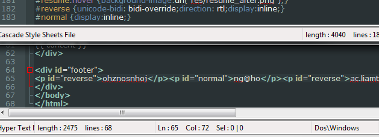

The portfolio is a mandatory assignment for all first year Engineering Science students.  
We choose how we build it, and since I strive to be robust myself, learning as many tools as possible,  
I built this engineering portfolio manually with these goals in mind:  

- Learn all the tools involved in creating a website rather than just making a website
- Explore designing for usability in terms of user-interface  
- Present my accomplishments in a robust, usable, and efficient way

Code and site history: [https://github.com/LemonPi/portfolio] (https://github.com/LemonPi/portfolio)

##Understanding the Problem
------------------------
The first step was researching how building a website could be broken down and to that effect I consulted a classmate,  
[Zhuowei Zhang](http://zhuoweizhang.net), who had more web development experience. With permission, I used his November [build](https://github.com/zhuowei/design/tree/5b67c2a088f0330f5681924b0d83a94319ba4b96) as my starting point.  

I found the problem of building a website can be decomposed into:  

- Content
- Layout
- Styling
- Hosting

##Solution Pool  
---------------
In line with my engineering process, solutions for each problem component were generated.  

1. Content needs to be easily editable, not bogged down in syntax
  - HTML: too much syntax; its strength in versatility may be useful though
  - Markdown:  although functionality is limited and requires parsing into HTML, great for the purpose of creating and maintaining content
  
2. Layout needs to readable by all browsers, as quickly as possible
  - HTML: pretty much the only choice, and the syntax is not a problem since there will only be one layout  

3. Styling needs to be supported by most browsers and easily changeable; loading speed (file size) is a consideration for first time visitors
  - CSS: superior to HTML for styling in every way

4. Hosting needs to be reliable, fast, and not place too many restrictions on usage
  - ECF UToronto: very fast, but restricted to "satisfy(ing) the requirements of some web based courses"
  - UTORweb: restricted to "individual use in support of one's role in the University"
  - Google Sites: slower, but no restrictions on usage 
  - GithubPages: slower, but no restrictions on usage and provides server side Jekyll to parse markdown into HTML  
    Note that users are only viewing static HTML pages, markdown is parsed 

##Solution Comparison
--------------------
The combination that I selected was (Markdown + HTML) + CSS + Jekyll + GithubPages.  
Markdown does not natively support tables or CSS classes, so HTML is used to generate tables and picture frames.  
Jekyll is quite robust in being able to parse multiple languages in one file - a YAML header, HTML elements, and markdown elements.  
One area of improvement for Jekyll is to support markdown inside HTML div elements.  

An important part of my engineering design process is comparing solutions against each other.  
Out of 256 portfolios posted by my classmates, 189 were made using Wix, 21 Wordpress, 20 Weebly.  
My current portfolio was compared against empty templates from Wix, Wordpress, and Weebly  
using the metric of no-cache first visit load time for efficiency.  
Usability can be partially measured by load time, but otherwise is more to do with layout and user-interface. 

<table class="pretty">
<tr>
  <th>Site</th>
  <th>Users</th>
  <th>HTTP Requests</th>
  <th>Home page load time without caching (ms)</th>
  <th>Average time per request (ms)</th>
</tr>
<tr>
  <td>Wix</td>
  <td>189</td>
  <td>75</td>
  <td><a href="wixload.png">700-1500</a></td>
  <td>15</td>
</tr>
<tr>
  <td>Wordpress</td>
  <td>21</td>
  <td>49</td>
  <td><a href="wordpressload.png">1200-2000</a></td>
  <td>33</td>
</tr>
<tr>
  <td>Weebly</td>
  <td>20</td>
  <td>22</td>
  <td><a href="weeblyload.png">1200-1400</a></td>
  <td>59</td>
</tr>
<tr>
  <td>This site</td>
  <td>N/A</td>
  <td>2</td>
  <td><a href="mysourceload.png">200-240</a></td>
  <td>120</td>
</tr>
</table>

The load times (including mine) are reduced to about 40% after first visit due to caching,  
but first impressions often make the greatest impact on user satisfaction.  

An important aspect to reducing load time is reducing the number of HTTP requests.  
Each request carries overhead that is often greater than time spent on receiving data, as is the case for my home page.

Only 1ms spent on receiving data!

In light of this, Wix provides great hosting by having a low load time to requests made ratio; however,  
the relationship between request number and load time is not linear, and should be **considered along with total load time**.  
For me, these sites do not give enough control to the developer over what gimmicks the user has to face and thus is not robust enough.  

##Design decisions for usability  
---------------------------------
In my opinion, making a product more usable is almost equivalent to increasing its quality - the overall feel of the product.  
Attention to detail with the consideration of what could irk the users is key to my process of designing for usability.  
These are the key design decisions to make this site more usable:  

1. Table rows highlight on hover to easily track items belonging to the same row; I personally had this difficulty with data sheets  
([demonstrated here](/portfolio/evaluations/handmixer/#efficiency))  

2. Page anchors allow parts of the page to be redirected to; makes redirect links more relevant  

3. Site and page history at the footer of each page to allow anyone interested to see how I have progressed  

4. Dynamic scaling of page elements (including images) to accomodate for different monitor sizes and avoid stretching  

5. Subtle bump down of navigation bar links when activated to provide a more satisfying clicking experience

6. No Javascript unless absolutely necessary to avoid the overhead of loading additional resources

7. Thumbnail of pictures with links to full-size versions where appropriate to reduce loading time  

Example of embedding large images; 42s load time!

##Prototyping
--------------
Developing for the web inherently makes it easy to prototype.  
Jekyll can serve the site locally and constantly regenerate each time an edit is made.

Rapid prototyping with Jekyll made easy

##Polishing
------------
Rapidly prototyping a product is fine for initial launch and ironing out bugs, but I believe great usability comes from long term polish.  
Nuances take time and usage to notice, therefore I will gradually add features to improve the quality of my portfolio.  

Reverse email entry to protect against spam bots

Some features improve the security, and others are for user appeal.

Attention grabbing gallery

Presenting visuals first, especially interactive ones, highly engage readers.

Visual and interactive flowchart for my process page

The interactive flowchart took a little more work than it appears because I wanted to keep it clean from JavaScript.  
Unfortunately I had to resort to JS to make it **work on mobile devices**; will seek lighter alternatives in the future.  

Check the page history to see when these features were added!

##Gains from Experience
-----------------------
- Understanding of the components to creating an efficient website
- Proficiency in CSS, HTML, and markdown
- Principles: designing for usability is attention to detail to provide a quality user experience