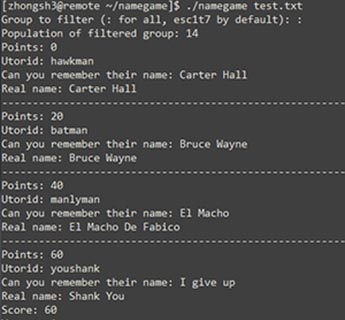
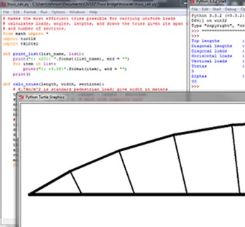

<h1 style="text-align:center;font-size:50px;">Personal Projects</h1>

<a href="headset/">

<h1 class="caption-title">Headset and Glasses</h1>
Request for Proposal on the discomfort of wearing both together   
Feb 2014

</a>

<a href="namegame/">

<h1 class="caption-title">Name Game</h1>
Gives you usernames and quizzes you on real names using string processing in C    
Jan 2014

</a>

<a href="portfolio/">

<h1 class="caption-title">Engineering Design Portfolio</h1>
The making of this portfolio    
Nov 2013 - present

</a>

<a href="binder/">

<h1 class="caption-title">Binder Misalignment</h1>
Redesign of binder shields into a spring that offers a more convenient method of opening the rings  
Nov 2013

</a>

<a href="aerator.html">

<h1 class="caption-title">Material Selection</h1>
Detailed design analysis of material selection for a kitchen aerator     
Nov 2013

</a>

<a href="bridgedesign/">

<h1 class="caption-title">Truss Bridge Design</h1>
Bridge analysis, optimization, and drawing using python   
Oct 2013

</a>

 --------------------------
 - [Request for Proposal: Headsets and Glasses for communication operators](headset/) - Feb 2014
 
 - [User-real name matching game in C](namegame/) - Jan 2014
 
 - [**Engineering design portfolio**](portfolio/) - Nov 2013 and ongoing
 
 - [**Conceptual Design: Binder ring misalignment**](binder/) - Nov 2013
 
 - [Detailed Design: material selection for aerator](aerator.html) - Nov 2013
 
 - [CIV 102: Pedestrian truss bridge design](bridgedesign/) - Oct 2013
