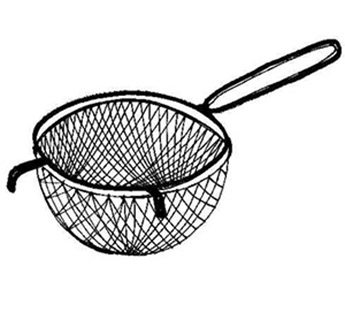

<h1 align="center">Personal Projects</h1>

<a href="namegame/">

<h1>Name Game</h1>
Gives you usernames and quizzes you on real names using string processing in C    
Jan 2014

</a>

<a href="portfolio/">

<h1>Engineering Design Portfolio</h1>
The making of this portfolio    
Nov 2013 - present

</a>

<a href="binder/">

<h1>Binder Misalignment</h1>
Redesign of binder shields into a spring that offers a more convenient method of opening the rings    
Nov 2013

</a>

<a href="aerator.html">

<h1>Material Selection</h1>
Detailed design analysis of material selection for a kitchen aerator    
Nov 2013

</a>

<a href="bridgedesign/">

<h1>Truss Bridge Design</h1>
Bridge analysis, optimization, and drawing using python    
Oct 2013

</a>

 --------------------------
 - [**User-real name matching game in C**](namegame/) - Jan 2014
 
 - [**Engineering design portfolio**](portfolio/) - Nov 2013 and ongoing
 
 - [**Conceptual Design: Binder ring misalignment**](binder/) - Nov 2013
 
 - [Detailed Design: material selection for aerator](aerator.html) - Nov 2013
 
 - [CIV 102: Pedestrian truss bridge design](bridgedesign/) - Oct 2013
