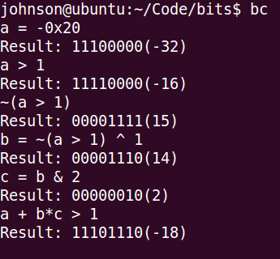
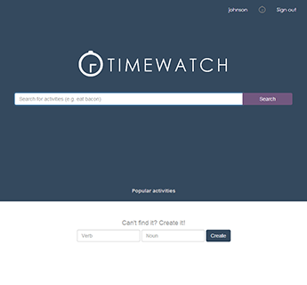

<h1 style="text-align:center;font-size:50px;">Personal Projects</h1>

<a href="../sal/">

<h1 class="caption-title">SAL</h1>
Simple Algorithms and Data structures    
Oct 2014 - Jan 2015

</a>

<a href="clisp/">

<h1 class="caption-title">Clisp</h1>
Lisp interpreter (scheme dialect) in C++    
Aug 2014

</a>

<a href="bincalc/">

<h1 class="caption-title">Bincalc</h1>
Binary calculator for bit manipulation practice and stream processing    
July 2014

</a>

<a href="timewatch/">

<h1 class="caption-title">Timewatch</h1>
Social platform and utility for trending activities and time management     
Feb 2014 - present

</a>

<a href="icecube/">

<h1 class="caption-title">ICE-Cube</h1>
Meat Refridgeration without grid electricity     
March 2014

</a>

<a href="headset/">

<h1 class="caption-title">Headset and Glasses</h1>
Request for Proposal on the discomfort of wearing both together   
Feb 2014

</a>

<a href="portfolio/">

<h1 class="caption-title">Engineering Design Portfolio</h1>
The making of this portfolio    
Nov 2013 - present

</a>

<a href="binder/">

<h1 class="caption-title">Binder Misalignment</h1>
Redesign of binder shields into a spring that offers a more convenient method of opening the rings  
Nov 2013

</a>

      

 --------------------------
 - [**Simple Algorithms and Data Structures library**](sal/) - Oct 2014 to Jan 2014

 - [**Clisp - Lisp interpreter**](clisp/) - Aug 2014
 
 - [Binary calculator](bincalc/) - July 2014
 
 - [**Timewatch**](timewatch/) - Feb 2014 and ongoing
 
 - [**ICE-Cube Meat refrigeration without electricity**](icecube/) - March 2014
 
 - [Request for Proposal: Headsets and Glasses for communication operators](headset/) - Feb 2014
 
 - [User-real name matching game in C](namegame/) - Jan 2014
 
 - [**Engineering design portfolio**](portfolio/) - Nov 2013 and ongoing
 
 - [**Conceptual Design: Binder ring misalignment**](binder/) - Nov 2013
 
 - [Detailed Design: material selection for aerator](aerator.html) - Nov 2013
 
 - [CIV 102: Pedestrian truss bridge design](bridgedesign/) - Oct 2013
