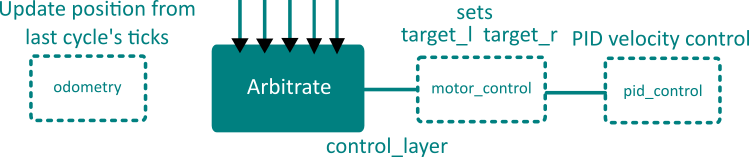

<div class="text-block">
<p>
	Together in a team of 3, we created two autonomous robots that could play
	connect-4 with ping pong balls on a <b>partially randomized gamefield</b>. Key features include:
</p>
<ul>	
	<li>an event driven gameplay loop (20Hz)
	<li>parallel position correct loop (100Hz)
	<li>human graphical interface for plotting waypoints
	<li>dead reckoning position system with multiple corrections
	<li>remembering and following waypoints
</ul>
<p> These unique features allowed us
	to quickly and consistently retrieve balls from the higher risk and reward randomized ball hoppers. 
	For more detailed coverage of the mechanical and electrical components, see 
	<a href="design_report.pdf">full design document</a>
</p>
</div>

<div class="toc">
 <a class="toc-link toch2" href="#team">The Team</a>
 <a class="toc-link toch2" href="#task">The Task</a>
 <a class="toc-link toch2" href="#overview">System Overview</a>
 <a class="toc-link toch3" href="#overview#decisions"><b>Key Design Decisions</b></a>
 <a class="toc-link toch2" href="#strengths">Strengths</a>
 <a class="toc-link toch2" href="#room_for_improvement">Room for Improvement</a>
 <a class="toc-link toch2" href="#nav">Navigation</a>
 <a class="toc-link toch3" href="#nav#odometry">Odometry</a>
 <a class="toc-link toch3" href="#nav#gameplay">Gameplay Layers</a>
 <a class="toc-link toch3" href="#nav#control">Motor Control</a>
 <a class="toc-link toch3" href="#nav#pid">PID</a>
 <a class="toc-link toch2" href="#correction"><b>Position Correction</b></a>
 <a class="toc-link toch3" href="#correction#position">Passive Position Correct</a>
 <a class="toc-link toch3" href="#correction#theta">Passive Theta Correct</a>
 <a class="toc-link toch3" href="#correction#redline">Passive Red Line Correct</a>
 <a class="toc-link toch3" href="#correction#touchwall">Touch Wall Correct</a>
 <a class="toc-link toch2" href="#debug">Debugging and Integration</a>
 <a class="toc-link toch2" href="#human"><b>Human Interaction</b></a>
 <a class="toc-link toch2" href="#reflection"><b>Reflection</b></a>
 <a class="toc-link toch2" href="#gains">Gains from Experience</a>
 <p class="toc-caption">(bolded sections are more interesting)</p>
 <p class="toc-toggle">toggle TOC</p>
</div>

The two robots in action:

<iframe width="560" height="315" src="https://www.youtube.com/embed/fF3lDIq3bEM" frameborder="0" allowfullscreen></iframe>

<h2 class="anchor">The Team <a class="anchor-link" title="permalink to section" href="#team" name="team">&para;</a></h2>
-------------------------------

 - [Alyf](http://alyfjanmohamed.wix.com/design-portfolio) (Circuits)
 - [Howard](http://howarddpunan.wix.com/yuhaoduan) (Electromechanics)
 - Johnson (Microcontroller)


<div class="frames">

<p>Finemen - Johnson, Howard, and Alyf (in order)</p>
</div>


<h2 class="anchor">The Task <a class="anchor-link" title="permalink to section" href="#task" name="task">&para;</a></h2>
-------------------------------
 - 7 minute games
 - deposit ping pong balls into the gameboard at the middle of the gamefield
 - each ball = 1 point, connecting 4 awards additional 4 points for you and -2 for the opponent
 - 2 static hoppers on the far corners, each holding 4 balls
 - 2 randomly placed hoppers in the center, each holding 7 balls
 - the robot(s) can only manipulate 1 ball at a time
 - gamefield is gridded in 20x20 cm blocks with black lines
 - a red line down the center
 - $250 limit on components used
 - 3kg limit on mass
 - 40x40x40cm total size constraint

 [Full game description](game_desc.pdf)


<div class="frames">

<p>Top down view of one side of the gamefield</p>
</div>


<h2 class="anchor">System Overview <a class="anchor-link" title="permalink to section" href="#overview" name="overview">&para;</a></h2>
-------------------------------
<div class="text-block">
<p>
	The central philosophy driving our design was to shift complexity to systems that are
	easier to debug. This meant making the mechanical and circuit components as simple as possible
	while building a sophisticated logic system that would elevate the simple components' functionality
	by integrating them together. The main reason is that a mechanical or circuits failure could cause
	expensive (time and money) setbacks whereas software failures can be fixed immediately at no cost.
</p>
<p>
	At the highest level, the logic is split into a gameplay system and a position correction system 
	for each robot, with gameplay run at 20Hz and correction run at 100Hz. 
	The necessity of a dedicated position correction system was determined through testing without
	it and observing accumulated drift error from relying solely on odometry. 
	This is due to imperfections in our measurement of wheel dimensions (relative sizes), 
	momentum of DC motors, and the imperfect contact of the wheels to the game board.
</p>
<p>
	The fundamental state for both robots includes:
	<ul>
		<li>position (x,y,theta) where theta is in (-&pi;, &pi;]
		<li>stack of targets with (x,y,theta,type) where theta is desired arrival theta and type is associated with a gameplay action
	</ul>
</p>
<p>
	An important detail is the <b>strict separation of tasks and limitations on communication methods
	between parallel systems</b>. The gameplay system is responsible for directing all the actions of the
	robots, communicating with the correction system only via its internal position. This is essential
	for minimizing coupling between the systems, which introduces complexity and overhead (especially true
	for systems running at different frequencies). See the flowchart below for the control flow of the 
	gameplay system architecture for both robots.
</p>

</div>

<a name="gameplay_flowchart"> </a>


<div class="text-block">
<p>
	Only the navigation portion from gameplay and the correction system will be convered in detail here;
	for more detail on the gameplay layers and the mechanical and electrical aspects of our robots, see
	the <a href="design_report.pdf">full design document</a>.
</p>
</div>


<h3 class="anchor">Key Design Decisions <a class="anchor-link" title="permalink to section" href="#overview#decisions" name="overview#decisions">&para;</a></h3>

<div class="text-block">
<p>
	The key design decision for having <b>2 robots</b> came about as we decomposed the problem
	into semi-independent tasks:
</p>
<ol>
	<li>Grabbing the ball
	<li>Lifting and playing the ball
	<li>Moving and navigating
	<li>Locating and avoiding hoppers
	<li>Reading gameboard state
</ol>
<p>
	The tasks could be naturally divided into two camps - retriever (<b>Rbot</b>) {1,3,4} 
	and gameplayer (<b>Gbot</b>) {2,5}.
	Dividing the tasks this way enables <b>pipelining</b>; the retriever could start retrieving another
	ball before the gameplayer finishes playing the ball.
	More importantly, dividing the tasks allows us to use much simpler mechanical actuators,
	as each actuator has only one job. 
</p>
<br>
<p>
	Another key design decision was to rely on a <b>dead reckoning position</b> system.
	Most teams relied on line-following or sonar distance sensing, both of which limited the 
	robot to move in a certain way (either to follow lines or walls). This limitation would
	have caused difficulties in retrieving from the center hoppers, which were not on lines
	and required different angles of approach for different orientations (difficulty for wall following).
</p>
<p>
	Of course, dead reckoning has the weakness of accumulated drift error, which was especially
	present in our robots since we used cheap ($3) motors and wheels. This led to our position correct
	system.
</p>
</div>


<h2 class="anchor">Strengths <a class="anchor-link" title="permalink to section" href="#strengths" name="strengths">&para;</a></h2>
-------------------------------
 - fast average ball retrieval time (~30s per ball)
 - arbitrary waypoint (human plotted) traversal
 - reliable retrieval from random middle hoppers (~90% success rate)
 - independent and pipelined ball retrieval and ball placement in gameboard
 - robust navigation system (position correction allows the retriever to stay in the game without reset)

<h2 class="anchor">Room for Improvement <a class="anchor-link" title="permalink to section" href="#room_for_improvement" name="room_for_improvement">&para;</a></h2>
-------------------------------
 - **interface system mechanically unreliable** (largest pitfall resulting in multiple resets)
 	- somewhat distance sensitive to the gap between robots
 	- large gap introduced misses if gamefield is not flat
 	- small gap introduced sliding if the two robots touch each other while maneuvering
 - cheap mechanical system resulted in tradeoff between reliability and speed
 	- wheels would slide too much when going beyond half speed


<h2 class="anchor">Navigation <a class="anchor-link" title="permalink to section" href="#nav" name="nav">&para;</a></h2>
-------------------------------

<div class="text-block">

<p>
	In each gameplay cycle (20Hz), the position is first updated via the <code>odometry</code> module,
	then it becomes available for each gameplay layer to query. Using its internal position, sensor information,
	and the top-most target position, each gameplay layer decides whether it is active or not, and if so, 
	set the targetted speed and angle. The target of the highest priority layer is then translated into
	a directly measured value for both wheels in the <code>motor_control</code> module. The <code>pid_control</code>
	module then adjusts motor output to reach the targetted value. 
</p>
<p>
	This process is illustrated in the diagram below and will be explained in more detail in following sections.
</p>
</div>



<h3 class="anchor">Odometry <a class="anchor-link" title="permalink to section" href="#nav#odometry" name="nav#odometry">&para;</a></h3>
<div class="text-block">
<p>
	At the lowest level, the movement of the robot has to be measured somehow to update its internal position.
	This is done by attaching a wheel encoder (see below) directly to the <b>pre-geared</b> motor shaft and
	placing an IR breakbeam sensor on both sides of it. Of course, this could be done internally in more expensive
	actuators, such as a continuous servo, but we had to split the budget for two robots.
</p>
<p>
	The ticks are accumulated over a gameplay cycle (50ms) and is converted to distances according to tediously
	calibrated <code>MM_PER_TICK</code> value (different for each wheel and not necessarily constant...). 
	Because the robot was chosen to implement a simple differential drive, updating its position with the delta-position
	follows the following equations:
</p>
</div>

```
// displacements in mm
double displacement_l = dir_l * (double)instant_tick_l * MM_PER_TICK_L;
double displacement_r = dir_r * (double)instant_tick_r * MM_PER_TICK_R;
double displacement = (displacement_l + displacement_r) * 0.5;

// total distance is a scalar
if (displacement > 0) tot_distance += displacement;
else tot_distance -= displacement;

theta += atan2(displacement_l - displacement_r, BASE_WIDTH);
x += displacement * cos(theta);
y += displacement * sin(theta);
```

<div class="frames">

<p>Wheel encoder designed and 3D printed by Howard</p>
</div>

<h3 class="anchor">Gameplay Layers <a class="anchor-link" title="permalink to section" href="#nav#gameplay" name="nav#gameplay">&para;</a></h3>
<div class="text-block">
<p>
	The gameplay layers implement a <a href="http://www.geology.smu.edu/dpa-www/robo/subsumption/">subsumption architecture</a>, which is best suited for the semi-random event driven environment the robot would be in. It is
	much more robust than a finite-state machine approach where the robot is assumed to be in a
	set of defined states. In this architecture, each behaviour runs parallel to one another with a 
	defined priority. <b>Many behaviours can be active at once</b>, such as avoid_boundary and navigate, but 
	avoid_boundary would have control as long as it is active since it holds higher priority.
	Each behaviour layer controls for speed and angle, measured in effective ticks per cycle (scaled by nonequal wheel size), and is either active or non-active. Their declaration can be seen below.
</p>

<pre><code>
struct Layer {
	// speed and angle in units of ticks/cycle
	int speed, angle, active;
};	
</code></pre>

<p>
	Layers can be activated inside itself, such as avoid_boundary, or inside other layers, such as hard_turn
	by navigate when the heading error becomes large enough.
	The layers are complementary and lead to effective emergent behavior, such as a smooth turn around
	boundaries, as shown below.
</p>
</div>


<div class="frames">

<p>red circle is boundary, white is with avoid_boundary active</p>
</div>

<p>
	For more detail on the implementation of each layer see the
	<a href="design_report.pdf">full design document</a>.
</p>


<h3 class="anchor">Motor Control <a class="anchor-link" title="permalink to section" href="#nav#control" name="nav#control">&para;</a></h3>
<div class="text-block">
<p>
	The <code>arbitrate</code> module selects the highest priority layer and passes onto the
	<code>motor_control</code> module to be converted to physically measureable units. The layers communicate
	only in terms of effective ticks per cycle (for speed and angle) for the center of the robot, which
	is converted to targetted ticks on left and right wheels in the following equations (somewhat simplified):
</p>
<pre><code>
target_l = control_layer.speed + control_layer.angle;
target_r = control_layer.speed - control_layer.angle;
</code></pre>
<ul>
	<li>positive angle turns clockwise
	<li>angle with same magnitude as speed pivots around 1 wheel
	<li>0 speed and some angle turns in place
</ul>
<p>
	These facts are results of the differential steering system and allow for easy abstraction
	to speed and angle, which are much easier to reason about.
</p>
</div>

<h3 class="anchor">PID <a class="anchor-link" title="permalink to section" href="#nav#pid" name="nav#pid">&para;</a></h3>
<div class="text-block">
<p>
	The <code>pid_control</code> module is the last necessary one for a functional robot.
	A closed loop control system (in which feedback drives the input based on error to target)
	is necessary to ensure the targets are reached in a steady fashion. The PID controller 
	completes the gap between the software desired speed and the physical responding speed. 
	The <b>same input (pulse width modulation value, 0-255) to the motors results in different 
	actual speeds</b> depending on supplied voltage and current, terrain, and momentum.
</p>
</div>


<h2 class="anchor">Position Correction <a class="anchor-link" title="permalink to section" href="#correction" name="correction">&para;</a></h2>
-------------------------
<div class="text-block">
<p>
	Since each robot has a different array of sensors, their position correct systems are also very different.
	However, one commonality is that all of the correction functions are <b>passive</b> in the sense 
	that they do not directly control for speed or angle like a gameplay behaviour layer, 
	only updating (x, y, theta). Separating correction and gameplay allows for easier debugging and makes
	the robots faster since it does not interrupt the gameplay behaviour to correct. 
	The flowchart below summarizes the similarities and differences of the system for both robots.
</p>
</div>

<a name="correction_flowchart"> </a>


<div class="text-block">
<p>
	Both robots share a photoresistor near the center of the bottom, but use it for different purposes. 
	The photoresistor coupled with an LED can detect both black and red lines without being 
	able to distinguish between them. For the retriever, the IR sensors cannot read red
	lines, so when the photoresistor detects a line while the last black line was detected far enough away
	(>35mm), Rbot is likely over the center red line. For Gbot, its motion is simplistic enough that it does not
	need this extra information and can correct on every line.
</p>

<p>
	One condition shared by all line correction functions is the need to avoid the ambiguity of intersections,
	shown below:
</p>
</div>


<div class="text-block">
<p>
	Line detectors activating are only valid when they are over a green region, but
	enforcing this is a challenge, since the actual location of the robot is unknown.
	The internal position combined with distance since last line crossed
	and which side IR sensor hit gives enough information for us to avoid erronous
	correction on an intersection 100% of the time during testing.
</p>
</div>

<h3 class="anchor">Passive Position Correct <a class="anchor-link" title="permalink to section" href="#correction#position" name="correction#position">&para;</a></h3>
<div class="text-block">
<p>
	This function is activated when a line is fully passed - when the center sensor (IR for Rbot and
	photoresistor for Gbot) reads no line after 3 consecutive cycles of reading a line. Leaving a line is used
	instead of hitting a line since it requires consecutive cycles of being on a line prior to leaving it, giving a
	point of checking for accidental readings.
</p>
<p>
	The position closer to a grid line is rounded to that grid line, accounting for the line width using the
	direction of movement (theta). This essentially splits each grid into four quadrants, shown below:
</p>
</div>


<h3 class="anchor">Passive Theta Correct <a class="anchor-link" title="permalink to section" href="#correction#theta" name="correction#theta">&para;</a></h3>
<div class="text-block">
<p>
	Drift error mostly manifests as an inaccurate theta, which can be corrected by assuming a
	straight path crossing a line and considering the distance between each sensor's first encounter of the line, illustrated and explained below:
</p>
</div>


<div class="text-block">
<p>
	The theta offset is relative to the normal of the line just crossed, trivially
	found using the best estimate given current theta and position. 
</p>
</div>

<h3 class="anchor">Passive Red Line Correct <a class="anchor-link" title="permalink to section" href="#correction#redline" name="correction#redline">&para;</a></h3>
<div class="text-block">
<p>
	A red line is indicated by the photoresistor reading a line with the last black line
	being read (> 35mm) away, assuming Rbot is not going backwards. Otherwise, red line correct always
	corrects the y coordinate to the center y (800mm) since that is the only place where a red
	line is.
</p>
<p>
	Because the IR sensors cannot detect the red line, this becomes an advantage near the center since there
	is no intersection ambiguity there. Every line the IR sensors detect there is an x line, allowing for
	accurate correction to both x and y near the center.
</p>
<p>
	It is because of this advantage that the Rbot is told to alternate between the two closest hoppers,
	which would be the center two. This forces it to always cross the center line and receive an always correct
	y position calibration. This is also why the rendezvous point of the two robots is along the center line,
	so that the two can always align their y position.
</p>
</div>


<h3 class="anchor">Touch Wall Correct <a class="anchor-link" title="permalink to section" href="#correction#touchwall" name="correction#touchwall">&para;</a></h3>
<div class="text-block">
<p>
	Two sonars at the front and back of Gbot gives absolute position of both ends. These values are
	averaged over 4 cycles and used to determine both the heading and the coordinate perpendicular to the wall
	for Gbot. Since Gbot does not need to respond to a random environment, a more reliable but less robust
	wall following strategy was used for its navigation. It would navigate hugging the walls along the left
	side to the gameboard, after which it would only move along the x-axis to play balls in different columns.
	The touch wall function is essential to keeping both the distance from the wall constant and the heading
	parallel to the wall, as illustrated below:
</p>
</div>


<h2 class="anchor">Debugging and Integration <a class="anchor-link" title="permalink to section" href="#debug" name="debug">&para;</a></h2>
-------------------------
<div class="text-block">
<p>
	Rbot's navigation system was designed to be the foundational system that would enable all the other behavious
	to be simple. Since it could navigate anywhere and arrive at any theta, the other behaviours could assume
	the robot has arrived at a location easy for the action to be carried out (such as right in front of a hopper
	to get a ball). This is in contrast to many other team's finite state machine approach where each state had
	to carry out its own navigation.
</p>
<p>
	To debug navigation, a graphical framework was built using serial communication between the Arduino and laptop,
	and the <a href="https://processing.org/">Processing</a> development environment. Each cycles' position is
	plotted as a dot, with the colour representing the active layer. This gave us a huge advantage in comparing the
	internal against the actual path travelled to pinpoint problematic layers and situations.
</p>
</div>

<div class="frames">
<a name="debug_map"> </a>
<p>Map produced by Processing at runtime; annotations added afterwards</p>
</div>

<div class="frames">

<p>Physical testing environment to match against internal map</p>
</div>


<h2 class="anchor">Human Interaction <a class="anchor-link" title="permalink to section" href="#human" name="human">&para;</a></h2>
-------------------------
<div class="text-block">
<p>
	The largest challenge to navigation was crossing lines unambiguously.
	The navigation routing takes the shortest path to its next target, having no intelligence
	of whether the path will be good or bad for correction purposes (how close does it pass intersections).
	Building this into the system is <b>very hard</b>, and our attempts had varying success.
	However, a human can decide what are good paths that compromise speed and correction opportunity very well.
</p>
<p>
	The simplest and most robust solution is to allow a human to plot recommended waypoints 
	at the start of the game using the graphical debugging framework. As seen in the <a href="#debug_map">debug map</a>
	above, the selected waypoints allow the robot to pass through the center of many lines while keeping
	the paths short.
</p>
</div>


<h2 class="anchor">Reflection <a class="anchor-link" title="permalink to section" href="#reflection" name="reflection">&para;</a></h2>
-------------------------
<div class="text-block">
<p>
	We did not win the competition. Despite having by far the most sophisticated navigation and
	correction software, we relied too much on this single system and underestimated the diffculty
	we added by the interaction between two robots. I believe a single robot with our navigation
	and correction system could easily win the competition since all but two other groups that I know of
	went only for the static corner hoppers (which were further away and limited maximum number of balls to 8).
</p>
<p>
	Or, keeping with two robots, a simpler, less versatile navigation system
	could have been pursued. This would have led to earlier debugging of other components and
	integration. Line following with a simple sensor bar would have likely worked adequately, and getting
	the ball from the corner hoppers could have been explored.
</p>
<p>
	Overall, too much complexity was attempted, which while successfully met, took too much time to
	implement and resulted in not enough time to test the integration.
</p>
</div>

<h2 class="anchor">Gains from Experience <a class="anchor-link" title="permalink to section" href="#gains" name="gains">&para;</a></h2>
-----------------------
 - Awesome friends
 - Expanded willpower from consecutive all-nigthers...
 - Basic control theory and PID
 - Subsumption architecture experience
 - Microcontroller progrmaming (Arduino with C++)
 - Processing and graphical debugging frameworks
 - Dead reckoning with correction (primitive form of 2D inertial navigation system)
 