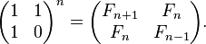
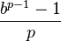
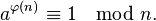

#### [sal/algo/numerics.h --- numeric](https://github.com/LemonPi/algo/blob/master/numeric.h)

<table class="pretty">
<tr><td><a class="doc-list-name" href="#exponent">modular_pow</a></td><td>modular exponentiation</td></tr>
<tr><td><a class="doc-list-name" href="#exponent">int_pow</a></td><td>integer exponentiation</td></tr>
<tr><td><a class="doc-list-name" href="#fibonacci">fibonacci</a></td><td>nth fibonacci number</td></tr>
<tr><td><a class="doc-list-name" href="#cyclic">make_cyclic</a></td><td>create a cyclic number from 1/prime in given base</td></tr>
<tr><td><a class="doc-list-name" href="#cyclic">cyclic_length</a></td><td>length of cyclic number from 1/prime in given base, 0 if acyclic</td></tr>
<tr><td><a class="doc-list-name" href="#is_pow">is_pow</a></td><td>checks if guess is a power of base</td></tr>
<tr><td><a class="doc-list-name" href="#is_square">is_square</a></td><td>checks if number is a perfect square</td></tr>
<tr><td><a class="doc-list-name" href="#gcd">gcd</a></td><td>greatest common denominator (binary)</td></tr>
<tr><td><a class="doc-list-name" href="#gcd">gcd_euclidean</a></td><td>Euclidean algorithm for gcd</td></tr>
<tr><td><a class="doc-list-name" href="#gcd">gcd_alt</a></td><td>Another way for expressing the Euclidean algorithm</td></tr>
<tr><td><a class="doc-list-name" href="#totient">totient</a></td><td>number of integers less than n that is relatively prime with n</td></tr>
<tr><td><a class="doc-list-name" href="#matmul">mul</a></td><td>matrix chain multiplication ordering</td></tr>
<tr><td><a class="doc-list-name" href="#factor">factorize</a></td><td>prime factorization of smooth numbers</td></tr>
<tr><td><a class="doc-list-name" href="#factor">factorize_rough</a></td><td>prime factorization of numbers with large prime factors</td></tr>
<tr><td><a class="doc-list-name" href="#factor">num_factors</a></td><td>total number of factors (including composites)</td></tr>
<tr><td><a class="doc-list-name" href="#factor">sum_factors</a></td><td>sum of all factors (including composites)</td></tr>
</table>

<h3 class="anchor">Exponentiation <a class="anchor-link" title="permalink to section" href="#exponent" name="exponent">&para;</a></h3>

Declaration


int modular_pow(int base, int exponent, int modulus);
int int_pow(int base, int exponent);


Example


// 13789^722341 % 2345
modular_pow(13789, 722341, 2345); 
// int 2029

int_pow(5, 3);
// int 125


Discussion

	The general approach is to exponentiate by squaring the base and
	reducing the exponent to at most half each time. This gurantees completion
	after <code>Θ(lg(exponent))</code> computations.
	Some more examples <a href="http://en.wikipedia.org/wiki/Exponentiation_by_squaring#Fixed_base_exponent">here</a>.

 

<h3 class="anchor">Fibonacci <a class="anchor-link" title="permalink to section" href="#fibonacci" name="fibonacci">&para;</a></h3>

Declaration


template <typename T>
T fibonacci(size_t n);


Parameters

<table class="pretty">
<tr><td>n</td><td>nth fibonacci number, sequence starting: 0, 1, 1..</td></tr>
</table>

Example


fibonacci<Infint>(1000);
// Infint 43466557686937456435688527675040625802564660517371780402481729089536555417949051890403879840079255169295922593080322634775209689623239873322471161642996440906533187938298969649928516003704476137795166849228875


Discussion

	Since exponentiation can be done in <code>Θ(lg(n))</code> time,
	expanding out clever matrices also shares that time complexity.
	Because the fibonacci sequence can be defined recursively as a <a href="http://en.wikipedia.org/wiki/Recurrence_relation#Solving_via_linear_algebra">linear
	combination of previous terms</a>, such a matrix exists (the companion matrix), and is:

 

<h3 class="anchor">Cyclic numbers <a class="anchor-link" title="permalink to section" href="#cyclic" name="cyclic">&para;</a></h3>

Declaration


size_t make_cyclic(int base, int prime);
size_t cyclic_length(int base, int prime);


Parameters

<table class="pretty">
<tr><td>base</td><td>number base</td></tr>
<tr><td>prime</td><td>prime that does not divide base</td></tr>
</table>

Example


// repeating part of 1/7 in base 10
make_cyclic(10, 7);
// size_t 142857

// length of repeating part of 1/7 in base 10
cycle_length(10, 7);
// size_t 6


Discussion

	Cyclic numbers are related to repeating decimals, from which they can be
	generated in a given base b with prime p using the relation

	They can be constructed by computing the digits of <code>1/p</code> in base b
	by long division and collecting the digits.

 

<h3 class="anchor">Integer power <a class="anchor-link" title="permalink to section" href="#is_pow" name="is_pow">&para;</a></h3>

Declaration


bool is_pow(int guess, int base);


Example


is_pow(4194304,4);
// bool true


Discussion

	Through divisions, checks whether guess is an integer power of base.

 

<h3 class="anchor">Perfect square <a class="anchor-link" title="permalink to section" href="#is_square" name="is_square">&para;</a></h3>

Declaration


bool is_square(long guess);


Example


is_square(21489798124);
// bool false


Discussion

	Used in tight loops of many number theory problems. Algorithm
	is written by <a href="http://stackoverflow.com/questions/295579/fastest-way-to-determine-if-an-integers-square-root-is-an-integer/18686659#18686659">maartinus from stackoverflow</a>.

 

<h3 class="anchor">Greatest Common Denominator <a class="anchor-link" title="permalink to section" href="#gcd" name="gcd">&para;</a></h3>
 

Declaration


unsigned int gcd(int a, int b);
unsigned int gcd_euclidean(int a, int b);
unsigned int gcd_alt(int a, int b);


Parameters

<table class="pretty">
<tr><td>a</td><td>integer (can be negative)</td></tr>
<tr><td>b</td><td>integer (can be negative)</td></tr>
</table>

Example


gcd(56, 91);
// unsigned int 7


Discussion

	Often used to solve combination problems. The binary optimization is used because 
	gcd's common usage in time critical operations. The alternative versions are much simpler and
	easier to memorize.

 

<h3 class="anchor">Euler's Totient <a class="anchor-link" title="permalink to section" href="#totient" name="totient">&para;</a></h3>
 

Declaration


unsigned long long totient(unsigned long long n);
auto phi = totient;


Parameters

<table class="pretty">
<tr><td>n</td><td>number to find the totient of</td></tr>
</table>

Example


totient(500);
// unsigned long long 200


Discussion

	Number of positive integers less than n that is relatively prime to n.
	 
	<code>1 < k < n  such that gcd(k,n) == 1</code>

	It is multiplicative, so
	<code>phi(a*b) == phi(a) * phi(b)</code>

	One application is in Euler's theorem: that a and n are relatively prime iff

	With applications <a href="http://en.wikipedia.org/wiki/Euler%27s_theorem">here</a>.

 

<h3 class="anchor">Matrix Chain Multiplication <a class="anchor-link" title="permalink to section" href="#matmul" name="matmul">&para;</a></h3>
 

Declaration


template <typename Indexable>
typename Indexable::value_type mul(const Indexable& items);
// specialization for matrices
Matrix<T> mul(const Indexable& mats);


Example


std::vector<Matrix<int>> mats;
size_t row {30}, col {35};
for (int i = 0; i != 100; ++i) {
	// generate sequence of random matrices 
	mats.push_back(random_matrix<int>(row, col, 0, 50));
	// next matrix's row must be prev matrix's col
	row = col;
	col = rand() % 100 + 5;	// between 5 - 105
}

mul(mats);
// Matrix<int> 


Discussion

	<code>Θ(n^3)</code> work is done optimally parenthesize the multiplications using dynamic programming.
	This order affects the number of operations required; using Wikipedia's example:

<blockquote>
	suppose A is a 10 × 30 matrix, B is a 30 × 5 matrix, and C is a 5 × 60 matrix. Then, 
	(AB)C = (10×30×5) + (10×5×60) = 1500 + 3000 = 4500 operations 
	A(BC) = (30×5×60) + (10×30×60) = 9000 + 18000 = 27000 operations.
</blockquote>

 

<h3 class="anchor">Integer Factorization <a class="anchor-link" title="permalink to section" href="#factor" name="factor">&para;</a></h3>
 

Declaration


template <typename T>
std::vector<T> factorize(T num);
template <typename T>
std::vector<T> factorize_rough(T num);
size_t num_factors(size_t num);
size_t sum_factors(size_t num);


Example


size_t num = 421412;

factorize(421412);
// vector<size_t> 2 2 137 769 (in order)

num_factors(num);
// size_t 12 (1 2 4 137 274 548 769 1538 3076 105353 210706 421412)

sum_factors(num);
// size_t 743820 (1 + 2 + 4 + 137 + ... + 421412)

// factorize primes or semiprimes
big_int semiprime = 32452843 * 32452867;	// 1053187797650881

// would still not be too slow
factorize(semiprime);

// would be faster
factorize_rough(semiprime);
/* would be much faster for repeated uses (primes are kept static) */


Discussion

	Factorizing in polynomial time is still an open problem.  
	Smooth numbers are ones that have small prime factors, 
	while rough numbers factor into large primes.
	Trial division is used to factorize both, with the difference being
	the divisor sequence for smooth numbers being that of odd numbers (2, 3, 5, 7, 9,...), while 
	rough numbers is that of generated primes (2, 3, 5, 7, 11,...). Trial division is very fast
	for practical encounters. 

 