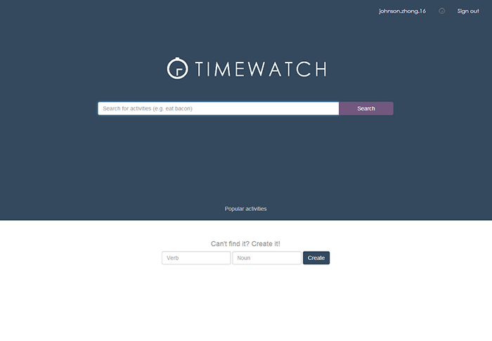
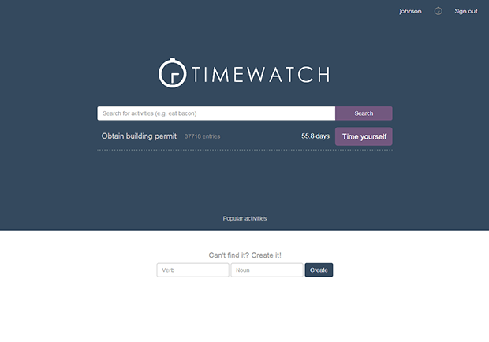

	<a href="http://timewatch.ca">Timewatch</a> is a social platform and productivity tool
	to help people find how long it takes to do something, anything.

	This project is ongoing (and where I spend most of my free time) and the team 
	currently includes
	<a href="http://zhuoweizhang.net/design">Zhuowei Zhang</a>

	I am responsible for high level and low level planning, general implementation, and design.

Timewatch current home page

</a>

<h2 class="anchor">Problem to Solve <a class="anchor-link" title="permalink to section" href="#problem" name="problem">¶</a></h2>
-------------------------

	Most people are notoriously bad at estimating how long it takes to complete tasks, 
	a major reason why plans fail and people’s confidence in their planning drops 
	<a href="#ref1">[1]</a></sup.. 
	Past failure with planning leads people to procrastinate and waste time 
	on small mindless tasks <a href="#ref2">[2]</a> <a href="#ref3">[3]</a> 
	with known outcomes and completion times for a sense of control <a href="#ref4">[4]</a>. 
	This procrastination leads to the failure of future plans, perpetuating the cycle <a href="#ref2">[2]</a> <a href="#ref5">[5]</a>. 
	This issue pervades society and is a major obstacle to personal achievement.

<h2 class="anchor">Operation Model <a class="anchor-link" title="permalink to section" href="#model" name="model">¶</a></h2>
-------------------------

	Timewatch's value comes from its database. The other features - user network, data visualization, and search - are 
	there to help users access the data.
	The current primary source for data is from crawling <a href="http://ckan.org/instances/#">Open Databases</a>, 
	but we anticipate users will become the driving force as the user base grows.

<h2 class="anchor">User Experience <a class="anchor-link" title="permalink to section" href="#experience" name="experience">¶</a></h2>
-------------------------

	Users start on the home search where they can query for any activity and other users.
	This is also where users can find out about popular activities, sorted by different time frames.
	Timewatch is meant to become the hub for sharing trending activities as well as 
	a personal time estimation and management tool.

Querying for an activity

	They can then start timing themselves, or stop a timer if one is in progress.
	Or they can directly view the time in detail.

Querying for an activity

	Users can challenge their friends to compete in an activity, 
	and receive requests the same way (with notification bell in the top right corner).

	The user experience ends in a timeline view, a newsfeed for recent friend activities,
	and a profile view, a log of their past and ongoing activities.

<h2 class="anchor">Design Process <a class="anchor-link" title="permalink to section" href="#process" name="process">¶</a></h2>
-----------------------

	I came up with the idea for Timewatch as an idea for 
	McGill's hackathon, <a href="http://mchacks.io/">McHacks</a>.

	From the start, I planned for Timewatch to have 3 components
	<ul>
		<li>Presentation and access to data
		<li>User network
		<li>Web crawling and data scraping
	</ul>
	
	I had no prior experience with web development apart from this static portfolio, 
	so I decided to use a framework in a familiar language to start,
	which meant Python with Django.

	During reading week, I familiarized myself with Django and made the
	presentation and access component of Timewatch in a day during the hackathon, with teammate Zhuowei.
	Unfortunately we didn't win any prizes, considering we didn't use any of their APIs, 
	but there was interest in Timewatch and we decided to pursue it further.

<h2 class="anchor">Gains from Experience <a class="anchor-link" title="permalink to section" href="#gains" name="gains">¶</a></h2>
-----------------------
 - Experience in Django and the model-view-controller pattern of web development
 - Database management (Postgre) (SQL and through Django)
 - Interest in web development
 - Experience in web crawling and scraping
 

<h2 class="anchor">References <a class="anchor-link" title="permalink to section" href="#reference" name="reference">¶</a></h2>
-------------------------

<a name="ref1">[1]</a> Lay C. H. 
	"Working to schedule on personal projects: An assessment of person-project characteristics and trait procrastination."
	<i>Journal of Social Behavior and Personality</i>. vol. I, no. 5, pp. 605-617, 1990.
 
<a name="ref2">[2]</a> Ferrari J. R. 
	"Procrastination: DIfferent time orientations reflect different motives."
	<i>Journal of Research in Personality</i>.
	vol. I, no. 41, pp. 707-714, 2007.
 
<a name="ref3">[3]</a> Griffin R. B. 
	"Planning, personality, and prediction: The role of future focus in optimistic time predictions." 
	<i>Organizational Behavior and Huiman Decision Processes</i>. 
	pp. 80-90, 2003.
 
<a name="ref4">[4]</a> Jackson T. 
	"Procrastination and Perceptions of Past, Present, and Future."
	<i>Individual Differences Research</i>. 
	vol. 1, no. 1, pp. 60-75, 2003.
 
<a name="ref5">[5]</a> Ferrari J. R. 
	"Self-Handicapping by Procrastinators: Protecting Self-Esteem, Social-Esteem, or Both?"
	<i>Journal of Research in Personality</i> [Online]. 
	vol. II, no. 3, pp. 245-261, 1991.
 

