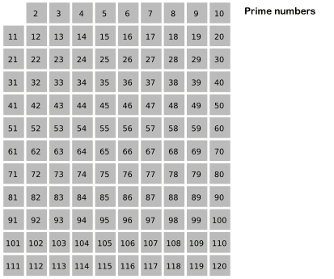

#### [sal/algo/prime.h](https://github.com/LemonPi/algo/blob/master/prime.h)

<table class="pretty">
<tr><th><a class="doc-list-name" href="#sieve">Sieve</a></th><th>segmented sieve class that generates primes</th></tr>
<tr><td><a class="doc-list-name" href="#next_prime">.next_prime</a></td><td>next prime in the sequence or after a guess</td></tr>
<tr><td><a class="doc-list-name" href="#closest_prime">.closest_prime</a></td><td>the nearest prime to a guess</td></tr>
<tr><td><a class="doc-list-name" href="#cur_prime">.cur_prime</a></td><td>current prime in the sequence</td></tr>
<tr><td><a class="doc-list-name" href="#nth_prime">.nth_prime</a></td><td>nth prime, starting from 2(n=1)</td></tr>
<tr><td><a class="doc-list-name" href="#primes_upto">.primes_upto</a></td><td>sequence of primes up to a upper limit</td></tr>
<tr><td><a class="doc-list-name" href="#is_prime">.is_prime</a></td><td>check if guess is a prime number</td></tr>
<tr><td><a class="doc-list-name" href="#count">.count</a></td><td>number of primes in sequence below current prime or an upper limit</td></tr>
</table>

<h3 class="anchor doc-header">Sieve of Eratosthenes <a class="anchor-link" title="permalink to section" href="#sieve" name="sieve">&para;</a></h3>   

Declaration


template <typename big_int = unsigned long long>
class Sieve;

// constructor
Sieve(big_int init_limit = 0, size_t seg_size = L1D_CACHE_SIZE);


Parameters

<table class="pretty">
<tr><td>init_limit</td><td>initial limit to sieve up to</td></tr>
<tr><td>seg_size</td><td>the batch size that primes are generated in</td></tr>
</table>

Example


// keep a sieve object if continuous work with primes is needed
using big_int = size_t;
Sieve<big_int> sieve;

// or to initialize with primes up to 1000 already generated
Sieve<> alt_sieve(1000);


Discussion

	Its working mechanism is depicted in the image below, where multiples of first encountered primes are marked. 
	Although not the theoretical fastest prime generating algorithm (with complexity <code>O(nlglg(n))</code>),
	an optimized Sieve of Eratosthenes is computationally the fastest way to do so. The most important optimization
	is to split the sieve into segments, the most efficient size being the L1 CPU cache. This vastly reduces cache
	misses, but most importantly lifts the memory limit on the largest prime sievable. Supposing 4GB of free memory,
	a traditional sieve using a 4GB large bit array (8 bits per byte) could only treat primes under 16 billion.

	The implementation is influenced by <a href="http://primesieve.org/">primesieve</a>, which boasts more
	extensive optimizations than SAL's, but I hope that my version is more readable and usable as part of larger
	projects.

 

<h3 class="anchor doc-header">Next prime <a class="anchor-link" title="permalink to section" href="#next_prime" name="next_prime">&para;</a></h3>   

Declaration


big_int next_prime();
big_int next_prime(big_int guess);


Parameters

<table class="pretty">
<tr><td>guess</td><td>a number immediately before the desired prime; returns the prime after if guess is a prime</td></tr>
</table>

Example


// using sieve from before
while (true) sieve.next_prime();
// generate infinite stream of primes (each of big_int)

sieve.next_prime(500);
// prime immediately after 500 -> 503
sieve.next_prime(503);
// if guess is a prime, will return next prime 509


Discussion

	Often either a sequence of primes or a prime "next to" a number is needed. 
	This method provides one means of doing so, the other one being closest_prime.
	Using next_prime to generate primes will result in uneven performance as the
	primes are sieved in segments at a time, with most of the work being at the boundary
	of a segment. 

 

<h3 class="anchor doc-header">Closest prime <a class="anchor-link" title="permalink to section" href="#closest_prime" name="closest_prime">&para;</a></h3>   

Declaration


big_int closest_prime(big_int guess);


Parameters

<table class="pretty">
<tr><td>guess</td><td>number around which a prime is wanted</td></tr>
</table>

Example


sieve.closest_prime(50000);
// big_int 49999


Discussion

	Primes often have use in information encoding due to its unfactorable nature.
	One application is finding acceptable sizes for hash tables. If the hash function
	is any number of Universal hashes, then the size should be a prime close to a power
	of two (such as <a href="http://en.wikipedia.org/wiki/Mersenne_prime">Mersenee primes</a>) 
	to replace division with shifts and additions but also while reducing clustering.

 

<h3 class="anchor doc-header">Current prime <a class="anchor-link" title="permalink to section" href="#cur_prime" name="cur_prime">&para;</a></h3>   

Declaration


big_int cur_prime() const;


Example


Sieve<> sieve;
for (int i = 0; i < 100; ++i)
	sieve.next_prime();

sieve.cur_prime();
// size_t 100th prime (n = 100)



Discussion

	Current prime in the sequence.

 

<h3 class="anchor doc-header">Nth prime <a class="anchor-link" title="permalink to section" href="#nth_prime" name="nth_prime">&para;</a></h3>   

Declaration


big_int nth_prime(big_int nth);


Parameters

<table class="pretty">
<tr><td>nth</td><td>prime index starting with 2(n=1), 3(n=2)</td></tr>
</table>

Example


sieve.nth_prime(1000);
// big_int 7919 (1000th prime)


Discussion

	Prime numbering starts with an index of 1; nth = 0 or nth < 0 returns 0,
	but beware of underflows if using an unsigned type such as size_t by default.

 

<h3 class="anchor doc-header">Primes up to <a class="anchor-link" title="permalink to section" href="#primes_upto" name="primes_upto">&para;</a></h3>   

Declaration


const std::vector<big_int>& primes_upto(big_int lim);


Parameters

<table class="pretty">
<tr><td>lim</td><td>upper limit for largest prime</td></tr>
</table>

Example


sieve.nth_prime(1000);
// big_int 7919 (1000th prime)


Discussion

	Returns a reference to the internal prime vector. Note that the last member
	is not guranteed to be the prime just under lim! 
	(it will be if lim is greater than internal limit prior to running)
	A separate copy guranteeing the last element is not done as that would be very inefficient and unncessary.
	If the last prime is too large, use <code>sieve.count(lim) - 1</code> to retrieve index of the desired back.

 

<h3 class="anchor doc-header">Check if prime <a class="anchor-link" title="permalink to section" href="#is_prime" name="is_prime">&para;</a></h3>   

Declaration


bool is_prime(big_int guess);


Example


sieve.is_prime(sieve.nth_prime(420000));
// bool true (the 420000th prime is a prime)


Discussion

	Accomplished by first filtering out <a href="../numeric/#factor">smooth numbers</a> (ones with small factors)
	then performing a binary search on existing primes or sieving up to the number;

 

<h3 class="anchor doc-header">Count primes under <a class="anchor-link" title="permalink to section" href="#count" name="count">&para;</a></h3>   

Declaration


size_t count();
size_t count(big_int upper);


Parameters

<table class="pretty">
<tr><td>upper</td><td>upper limit for largest prime</td></tr>
</table>

Example


sieve.count(1000000);
// size_t 78498 primes below a million 


Discussion

	Counting primes is more efficient than generating them and then counting
	since a bit sieve is used for counting only (8 byte statuses in 1 byte).
	Counting will not increase the current prime index or load primes into the
	internal vector.

 