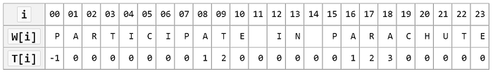

<h4><a href="https://github.com/LemonPi/algo/blob/master/search.h">sal/algo/search.h</a></h4>

<table class="pretty">
<tr><td><a class="doc-list-name" href="#bin_search">bin_search</a></td><td>binary search on ordered sequence</td></tr>
<tr><td><a class="doc-list-name" href="#intersection">intersection</a></td><td>set of common elements among a set of sets</td></tr>
<tr><td><a class="doc-list-name" href="#select">select</a></td><td>order selection of ith smallest element from unsorted sequence</td></tr>
<tr><td><a class="doc-list-name" href="#sub_match">sub_match</a></td><td>search for occurance of a substring inside a larger string</td></tr>
<tr><td><a class="doc-list-name" href="#lc_subseq">lc_subseq</a></td><td>longest common subsequence between 2 sequences</td></tr>
<tr><td><a class="doc-list-name" href="#lc_subseq">lc_subseq_len</a></td><td>length of longest common subsequence between 2 sequences</td></tr>
<tr><td><a class="doc-list-name" href="#lc_substr">lc_substr</a></td><td>longest common substring using a Suffix array</td></tr>
<tr><th><a class="doc-list-name" href="suffix_array">Suffix_array</a></th><th>efficient data structure for indexing large texts</th></tr>
</table>

<h3 class="anchor doc-header">Binary search <a class="anchor-link" title="permalink to section" href="#bin_search" name="bin_search">&para;</a></h3>

Declaration


template <typename Iter, typename T, typename Cmp>  // special comparator requires less and eq methods, can compare cross types
Iter bin_search(Iter begin, Iter end, const T& key, Cmp cmp);

// no given comparator overload uses std::less
template <typename Iter, typename T>
Iter bin_search(Iter begin, Iter end, const T& key);

// convenience overload for containers
template <typename Sequence, typename T>
typename Sequence::iterator bin_search(const Sequence& c, const T& key);


Parameters

<table class="pretty">
<tr><td>begin</td><td>iterator pointing to the first sequence element</td></tr>
<tr><td>end</td><td>iterator pointing to one past the last sequence element</td></tr>
<tr><td>key</td><td>value to find; should be an argument to <code>cmp.eq</code> and <code>cmp.less</code></td></tr>
<tr><td>cmp</td><td>comparator that should supply <code>bool less(T,T)</code> and <code>bool eq(T, T)</code></td></tr>
</table>

Example


std::vector<int> seq {1,3,12,14,15,18,20};
// bin_search assumes sequence is in order and elements are comparable
bin_search(seq.begin(), seq.end(), 12);
// iterator to element 12

bin_search(seq.begin(), seq.end(), 17);
// iterator seq.end()


Discussion

	A fundamental algorithm used because of its <code>Θ(lg(n))</code> time complexity (n is sequence length).
	This is in comparsion to linear sort, which has <code>Θ(n)</code> time complexity. As expected, this
	lg(n) performance is due to reducing the problem size to half each run through the Divide and Conquer strategy.
	Each iteration compares the median value against the target, relying on the sorted property to eliminate the
	half that is on the opposite side of the target relative to the median. 

 

	Some pitfalls to binary search are 1. it requires random access to the entire sequence, which implies
	2. the entire sequence need to be loaded in memory (or disk access will slow it down dramatically), and for
	small datasets (around n < 64) loses to linear search due to the lack of spacial locality. This issue will
	likely be more apparent in the future when more advanced optimizations for space locality becomes implemented.

<h3 class="anchor doc-header">Intersection <a class="anchor-link" title="permalink to section" href="#intersection" name="intersection">&para;</a></h3>

Declaration


template <typename Sequence>
unordered_set<typename Sequence::value_type> intersection(const set<Sequence>& s);


Parameters

<table class="pretty">
<tr><td>s</td><td>set of sequences from which the intersection should be taken on</td></tr>
</table>

Example


std::vector<int> seq {1,3,12,14,15,18,20};
std::vector<int> seq2 {1,3,5,6,7,8,20,32};
std::vector<int> seq3 {2,3,6,9,20,32,45,55};

intersection(std::set<vector<int>>{seq, seq2, seq3});
// unordered_set {3, 20} (elements shared by all 3 sequences)


Discussion

	Optimal with time complexity <code>O(n)</code> (n is total sum of sequence elements).
	In the worst case, each element will be looked at if all elements are shared.
	This algorithm, like many other element matching ones, is based on hashtable lookups, which 
	give average <code>O(1)</code> complexity. For known value ranges that's uniquely mappable to natural numbers,
	such as language alphabet, a fixed size array could be used with the value's number value as the hash. 

	For example, the UTF-8 encoding represents characters with 8 bits, uniquely mapping each character to
	a number between 0 and 255. An array of size 256 could be used to find the intersection and other characteristics
	among UTF-8 sequences.

<h3 class="anchor doc-header">Order selection <a class="anchor-link" title="permalink to section" href="#selection" name="selection">&para;</a></h3>

Declaration


template <typename Iter>
Iter select(Iter begin, Iter end, size_t i);

// convenience overload
template <typename Sequence>
typename Sequence::iterator select(Sequence& c, size_t i);


Parameters

<table class="pretty">
<tr><td>begin</td><td>iterator pointing to the first sequence element</td></tr>
<tr><td>end</td><td>iterator pointing to one past the last sequence element</td></tr>
<tr><td>i</td><td>ith smallest element of a sequence to select (1 is smallest)</td></tr>
</table>

Example


// no requirement on sortedness of course...
std::vector<int> v {632, 32, 31, 50, 88, 77, 942, 5, 23};
select(v.begin(), v.end(), 4);
// iterator to 4th element (50)


Discussion

	Selecting for minimums and maximums are relatively easy tasks requiring <code>O(n)</code> time,
	but finding an arbitrary ith ordered element requires a different approach.

	The algorithm implemented is quickselect, which, as the name suggests, is very similar to quicksort with
	<code>O(n)</code> performance.
	Their approach is the same - choosing a pivot to partition the sequence around based on <, but unlike quicksort,
	which recurses on both sides, quickselect recurses only on the side the target is on (found by comparing the
	rank=(pivot-begin) of the pivot against i).

	At the end of selection, the sequence will be partially sorted with the ith element being the ith smallest,
	and everything smaller than it on its left while everything larger than it on the right, with no order guranteed.

<h3 class="anchor doc-header">Substring matching <a class="anchor-link" title="permalink to section" href="#sub_match" name="sub_match">&para;</a></h3>

Declaration


template <typename Indexable>
typename Indexable::const_iterator sub_match(const Indexable& s, const Indexable& w);


Parameters

<table class="pretty">
<tr><td>s</td><td>an indexable sequence; the larger one - the "sentence"</td></tr>
<tr><td>w</td><td>the same type of sequence; the smaller one - the "word"</td></tr>
</table>

Example


std::string a {"It was the best of times..."};
std::string c {"the best"};

sub_match(a, c);
// const_iterator to 't' in a


Discussion

	An <code>O(n)</code> (n is length of sentence) algorithm for finding a 
	substring inside a larger sentence. This finds applications in biomedical computing,
	such as finding a codon sequence inside a chromosome.

	This algorithm uses the information implicit in where the matching failed inside the word
	to prevent wasteful backtracking. An example from wikipedia:

	When matching fails before 'A' with i=8, there is no possibility that another match started during the match,
	as the word starts with 'P' and none have been encountered. For backtracking to be necessary, the matching
	has to fail on a prefix of the word, such as "PA-" at i=9, and "PAR-" at i=18.

<h3 class="anchor doc-header">Longest common subsequence <a class="anchor-link" title="permalink to section" href="#lc_subseq" name="lc_subseq">&para;</a></h3>

Declaration


template <typename Indexable>
Indexable lc_subseq(const Indexable& a, const Indexable& b);

template <typename Indexable>
size_t lc_subseq_len(const Indexable& a, const Indexable& b);


Parameters

<table class="pretty">
<tr><td>a</td><td>An indexable sequence</td></tr>
<tr><td>b</td><td>Another sequence of the same type</td></tr>
</table>

Example


std::string a {"It was the best of times..."};
std::string b {"That's the best orange juice!"};

lc_subseq(a, b);
// string "as the best o ie"
lc_subseq_len(a, b);
// size_t 16


Discussion

	A subsequence is made by removing some elements but keeping the same order.
	A substring in addition needs to be from continuous elements. Finding the longest common subsequence (LCS)
	is crucial for resolving similarity among data, important for data compression, revision control, and bioinformatics.

	A dynamic programming approach is used since the LCS of the two
	is also the LCS-last_matched_char of the two sequences less their last matched character.
	This yields <code>O(n*m)</code> time and space performance (n is length of a, m is length of b) for
	retrieving the LCS, and only <code>O(min(n,m))</code> space for retrieving the LCS length.

<h3 class="anchor doc-header">Longest common substring <a class="anchor-link" title="permalink to section" href="#lc_substr" name="lc_substr">&para;</a></h3>

Declaration


bool is_prime(big_int guess);


Example


std::string a {"It was the best of times..."};
std::string b {"That's the best orange juice!"};
// a wrapper around suffix array
lc_substr(a, b);

// with an integer sequence
using Int_seq = std::vector<int>;
Int_seq x {1,5,3,2,-1,6,2,1,4,3};
Int_seq y {6,2,1,4,3,5,3,2,-1,-5,2,3,7};
sal::Suffix_array<Int_seq> sa {x,y};

Int_seq z {sa.lc_substr()};
// Int_seq 6 2 1 4 3


Discussion

	Using a suffix array, the longest common substring can be found in <code>O(n)</code> time
	(although SAL's implemenation of a suffix array renders it <code>O(n(lg(n))^2)</code> time.
	This is done by concatenating the two sequences and indexing it into a suffix array.

	Then the longest common prefix (LCP) array is iterated over to find the maximum value filtering
	out the substrings from the same initial sequence.

	This algorithm can be extended to an arbitrary number of sequences, with the only alteration being
	that the scan over the LCP array needs to filter on consecutive n-suffixes sharing a minimum prefix,
	as well as additional checks for whether all initial sequences have been covered. 

