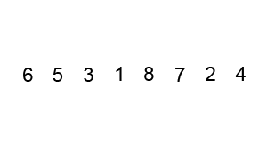

#### [sal/algo/sort.h](https://github.com/LemonPi/algo/blob/master/sort.h)

<table class="pretty">
<tr><td><a class="doc-list-name" href="#parittion">partition</a></td><td>reorder elements of a sequence either around a pivot or based on a predicate</td></tr>
<tr><th colspan="2">Comparison sorts (optimal runtime of <code>O(nlgn)</code>)</th></tr>
<tr><td><a class="doc-list-name" href="#bub_sort">bub_sort</a></td><td>sort a sequence by pairwise comparisons and swaps</td></tr>
<tr><td><a class="doc-list-name" href="#ins_sort">lin_sort</a></td><td>sort a sequence by building onto a partially sorted sequence with linear search</td></tr>
<tr><td><a class="doc-list-name" href="#ins_sort">ins_sort</a></td><td>sort a sequence by building onto a partially sorted sequence with binary search</td></tr>
<tr><td><a class="doc-list-name" href="#mer_sort">mer_sort</a></td><td>sort a sequence by recursively merging sorted subsequences</td></tr>
<tr><td><a class="doc-list-name" href="#qck_sort">qck_sort</a></td><td>sort a sequence by iteratively partitioning it in two</td></tr>
<tr><td><a class="doc-list-name" href="#heap_sort">heap_sort</a></td><td>sort a sequence by modeling it as a heap and iteratively extracting top</td></tr>
<tr><th colspan="2">Distribution sorts (optimal runtime of <code>O(n)</code>, requires "digit"-like substructure)</th></tr>
<tr><td><a class="doc-list-name" href="#cnt_sort">cnt_sort</a></td><td>sort a sequence by counting the distribution of occurrances</td></tr>
<tr><td><a class="doc-list-name" href="#rdx_sort">rdx_sort</a></td><td>sort a sequence using counting sort on each digit</td></tr>
<tr><th colspan="2">Hybrid sorts</th></tr>
<tr><td><a class="doc-list-name" href="tim_sort">tim_sort</a></td><td>sort a sequence using insertion sort to create short, sorted subsequences that are then merged</td></tr>
<tr><td><a class="doc-list-name" href="pat_sort">pat_sort</a></td><td>sort a sequence by simulating solitaire</td></tr>
</table>

	All sorting algorithms are called using iterators as shown below, unless shown otherwise.
	The parameters include the sequence [begin,end) where end is 1 element after the last.


std::vector<int> u {632, 32, 31, 88, 77, 942, 5, 23};
sort(v.begin(), v.end());


<h3 class="anchor doc-header">Partition <a class="anchor-link" title="permalink to section" href="#partition" name="partition">&para;</a></h3>   

Declaration


template <typename Iter>
Iter partition(Iter begin, Iter end);

// partition on a unary predicate
template <typename Iter, typename Unary_pred>
Iter partition(Iter begin, Iter end, Unary_pred p);


Parameters

<table class="pretty">
<tr><td>s</td><td>set of sequences from which the intersection should be taken on</td></tr>
</table>

Return value

Iterator to the pivot or the first element that
does not satisfy the predicate. 

Example


std::vector<int> u {632, 32, 31, 88, 77, 942, 5, 23};
partition(u.begin(), u.end());
// iterator to pivot 77
// 23 32 31 5 77 942 88 632 (all elements < 77 on left and > 77 on right)

partition(u.begin(), u.end(), {return n % 2;});
// iterator to 88
// 23 5 31 77 88 942 32 632 (all odd on left and all even on right)


Discussion

	A very important function that enables the divide and conquer capability of other functions such as
	quicksort and quickselect. <code>n - 1</code> comparisons or calls of the unary predicate is done,
	resulting in <code>O(n)</code> time complexity. As the comparisons and swaps are performed in place
	(only requiring a constant amount of memory for swap), the space complexity is <code>O(1)</code>.

 

<h3 class="anchor doc-header">Comparison sorts <a class="anchor-link" title="permalink to section" href="#comparison" name="comparison">&para;</a></h3>   

	Comparison sorts are distinguished by their use of binary comparison functions such as <code>std::less</code> (two inputs of the same type and a boolean output)
	to sort sequences by doing pairwise comparisons. This requires a minimum amount of comparisons to retrieve
	the necessary information and has been proven to be <code>O(nlgn)</code>, with the implication of being the lower
	bound for all comparison sorting algorithms' average and worst case time.

	The only assumption on the data type to be sorted is that it has be ordered - the "smaller" of two elements can
	be determined. This assumption is widley true and as a result comparison sorts are applicable to a wide range of 
	data types.

<h3 class="anchor doc-header">Bubble sort <a class="anchor-link" title="permalink to section" href="#bub_sort" name="bub_sort">&para;</a></h3>   

Declaration


template <typename Iter>
void bub_sort(Iter begin, const Iter end);


Parameters

<table class="pretty">
<tr><td>begin</td><td>iterator pointing to the first sequence element</td></tr>
<tr><td>end</td><td>iterator pointing to one past the last sequence element</td></tr>
</table>

Discussion

	An inefficient <code>O(n^2)</code> algorithm that bubbles (compares and then shifts) smaller elements
	from the right to the left. Alternatives exist for bubbling larger elements from left to right with the
	same performance. That variation is described by the animation below:

 

 

<h3 class="anchor doc-header">Insertion sort <a class="anchor-link" title="permalink to section" href="#ins_sort" name="ins_sort">&para;</a></h3>   

Declaration


// insertion sort using linear shifts
template <typename Iter>
void lin_sort(const Iter begin, const Iter end);

// using binary search to find correct location
template <typename Iter>
void ins_sort(const Iter begin, const Iter end);


Discussion

	A situational algorithm that depends on how far each element is away from their sorted position, 
	having time complexity <code>O(nk)</code>, where all elements are at most k places from correct position.
	This property is exploited in hybrid sorts such as timsort, where insertion sort is applied on short,
	nearly sorted parts of the sequence.

 

	The binary version is best suited for strings and other data types that have expensive comparisons
	relative to swaps. Otherwise, the linear shifting version performs better and is depicated in the
	animation below.

 

<h3 class="anchor doc-header">Merge sort <a class="anchor-link" title="permalink to section" href="#mer_sort" name="mer_sort">&para;</a></h3>   

Declaration


template <typename Iter>
void mer_sort(Iter begin, Iter end);


Discussion

	A <code>O(nlgn)</code> algorithm that uses <code>O(n)</code> auxiliary memory.
	Pure merge sort is rarely used in practice due to its memory overhead, leading it to be
	many times slower than quicksort. However, it does illustrate the divide and conquer
	strategy very well, as shown in the animation below:

 

<h3 class="anchor doc-header">Quick sort <a class="anchor-link" title="permalink to section" href="#qck_sort" name="qck_sort">&para;</a></h3>   

Declaration


template <typename Iter>
void qck_sort(Iter begin, Iter end);


Discussion

	A <code>O(nlgn)</code> algorithm that sorts in place significantly faster than any other
	pure comparison sort. It is both quick to sort and quick to implement (arguably the
	easiest <code>O(nlgn)</code> to implement). It relies on partitioning the sequence in two
	(<code>O(n)</code> operation) and then recursively sorting the two partitions.

 

<h3 class="anchor doc-header">Heap sort <a class="anchor-link" title="permalink to section" href="#heap_sort" name="heap_sort">&para;</a></h3>   

Declaration


template <typename Iter>
void heap_sort(Iter begin, Iter end);


Discussion

	A heap is a datastructure that always has an easily accessible min or max value, with <code>O(lgn)</code> time 
	to remake the heap after extracting the top element. Thus iteratively extracting the top element will result
	in a sorted extraction in <code>O(nlgn)</code> time. The image below illustrates the heap, which is usually 
	internally represented as a linear array, but can be thought of as a complete binary tree:

 

<h3 class="anchor doc-header">Distribution sorts <a class="anchor-link" title="permalink to section" href="#distribution" name="distribution">&para;</a></h3>   

	Distribution sorts have the strong assumption that the data type has a finite and known range.
	For exmaple, 16 bit shorts are constrained between -32768 to 32767, which has the finite range of
	65536. Many data types do not have a limited range, such as character strings, and are not well
	suited to be sorted using distribution sorts.

	However, with that strong assumption also comes a decrease in minimum bound, which is reduced to the
	optimal <code>O(n)</code>. It is not possible to be sublinear since each element has to be considered
	at least once. 

<h3 class="anchor doc-header">Counting sort <a class="anchor-link" title="permalink to section" href="#cnt_sort" name="cnt_sort">&para;</a></h3>   

Declaration


// operator extracts certain information from the element, such as a digit
template <typename Iter, typename Op>
void cnt_sort(Iter begin, Iter end, size_t range, Op op);

// by default extract all information
template <typename Iter>
void cnt_sort(Iter begin, Iter end, size_t range);


Parameters

<table class="pretty">
<tr><td>range</td><td>size of the bin to use for holding all potential values</td></tr>
<tr><td>op</td><td>extraction operator that optionally looks at only a part of the data</td></tr>
</table>

Example


std::vector<int> v {randgen(1048576, 100000)};	// 2^20

// need to know maximum for counting sort, else wastes one pass finding maximum
cnt_sort(v.begin(), v.end(), 1048577);
// can also not specify anything, additional call to min_max
cnt_sort(v.begin(), v.end());

// sort only on only bits 20-12 which only requires 2^8 = 256 bits of storage
cnt_sort(v.begin(), v.end(), 256, {return (n & 0xFF000) >> 12;});


Discussion

	Counting sort uses a direct address table (where the value is the key to a hashtable) to 
	keep count of the occurances of each unique value. One pass through the original data fully
	constructs the table in <code>O(n)</code> time, assuming it takes <code>O(1)</code> time to
	address the table.

	The sequence is then recreated in some kind of order implicit to the way the table is structured.
	The most basic form applied to non-positive integers would create a table where the index directly
	translates into the value, and iterating over the table from begin to end would recreate the original
	sequence sorted via <code>std::less</code> while iterating from end to begin would result in sorting
	via <code>std::greater</code>.

 

<h3 class="anchor doc-header">Radix sort <a class="anchor-link" title="permalink to section" href="#rdx_sort" name="rdx_sort">&para;</a></h3>   

Declaration


template <typename Iter>   // use intermediate struct for partial specialization
void rdx_sort(Iter begin, Iter end, int bits);

// internal implementation class for specialization on type
template<typename Iter, typename T, size_t range = 256>
struct rdx_impl;
// see the std::string and float specialization for how to specialize


Parameters

<table class="pretty">
<tr><td>bits</td><td>the highest bit to consider if the data spans less than [min,max]</td></tr>
<tr><td>range</td><td>the size of the direct address table used for counting sort</td></tr>
</table>

Example


std::vector<int> v {randgen(1048576, 100000)};	// 2^20

// need to know maximum for counting sort, else wastes one pass finding maximum
cnt_sort(v.begin(), v.end(), 1048577);
// can also not specify anything, additional call to min_max
cnt_sort(v.begin(), v.end());

// sort only on only bits 20-12 which only requires 2^8 = 256 bits of storage
cnt_sort(v.begin(), v.end(), 256, {return (n & 0xFF000) >> 12;});


Discussion

	Radix sort is an extension of counting sort that makes it much more practical for larger data types.
	Counting sort needs a direct address table to fit the entire range of the data, so for a data type with
	32 bits, it'd need an array of 2^32 bits, which would be too large for most computers. Radix sort,
	on the other hand, can operate on arbitrary "digits" (in practice certain bits) of the data at a time,
	with the usual digit size being 8 bits = 1 byte. Counting sort can then be seen as a special case of
	radix sort with the digit being the size of the entire data type.

	It runs in <code>O(nk)</code> time, where k is the number of digits in the data set corresponding to
	how many passes of counting sort will be done.

	Radix sort comes in two variants differentiated by whether it starts on the most or least significant
	digit. Contrary to intuition, sorting from the least significant to most significant digit works, and
	has the advantage of being stable - "equal" elements maintain their relative position at each pass
	of the sort. Stability is generally preferred, but is especially important when the property being
	sorted is only part of the item being sorted (ex. people can be sorted on names, but they also have
	hobbies and favourite colours). Correspondingly, SAL implements on the least significant digit variant.

 

<h3 class="anchor doc-header">Hybrid sorts <a class="anchor-link" title="permalink to section" href="#hybrid" name="hybrid">&para;</a></h3>   

	Hybrid sorts are usually what is used as standard libraries' general sorts, such as C++'s <code>std::sort</code>,
	which is a variant called Introsort switching from quicksort to heap sort based on the recursion depth.
	They maintain the generality of comparison sorts but also provide a speedup relative to pure comparison sorts.
	A disadvantage is that they are harder to implement optimally, as there is usually upkeep associated with 
	bookkeeping when to switch strategies.

<h3 class="anchor doc-header">Tim sort <a class="anchor-link" title="permalink to section" href="#tim_sort" name="tim_sort">&para;</a></h3>   

Declaration


template <typename Iter>   // use intermediate struct for partial specialization
void rdx_sort(Iter begin, Iter end, int bits);

// internal implementation class for specialization on type
template<typename Iter, typename T, size_t range = 256>
struct rdx_impl;
// see the std::string and float specialization for how to specialize


Parameters

<table class="pretty">
<tr><td>bits</td><td>the highest bit to consider if the data spans less than [min,max]</td></tr>
<tr><td>range</td><td>the size of the direct address table used for counting sort</td></tr>
</table>

Example


std::vector<int> v {randgen(1048576, 100000)};	// 2^20

// need to know maximum for counting sort, else wastes one pass finding maximum
cnt_sort(v.begin(), v.end(), 1048577);
// can also not specify anything, additional call to min_max
cnt_sort(v.begin(), v.end());

// sort only on only bits 20-12 which only requires 2^8 = 256 bits of storage
cnt_sort(v.begin(), v.end(), 256, {return (n & 0xFF000) >> 12;});


Discussion

	Radix sort is an extension of counting sort that makes it much more practical for larger data types.
	Counting sort needs a direct address table to fit the entire range of the data, so for a data type with
	32 bits, it'd need an array of 2^32 bits, which would be too large for most computers. Radix sort,
	on the other hand, can operate on arbitrary "digits" (in practice certain bits) of the data at a time,
	with the usual digit size being 8 bits = 1 byte. Counting sort can then be seen as a special case of
	radix sort with the digit being the size of the entire data type.

	It runs in <code>O(nk)</code> time, where k is the number of digits in the data set corresponding to
	how many passes of counting sort will be done.

	Radix sort comes in two variants differentiated by whether it starts on the most or least significant
	digit. Contrary to intuition, sorting from the least significant to most significant digit works, and
	has the advantage of being stable - "equal" elements maintain their relative position at each pass
	of the sort. Stability is generally preferred, but is especially important when the property being
	sorted is only part of the item being sorted (ex. people can be sorted on names, but they also have
	hobbies and favourite colours). Correspondingly, SAL implements on the least significant digit variant.

 